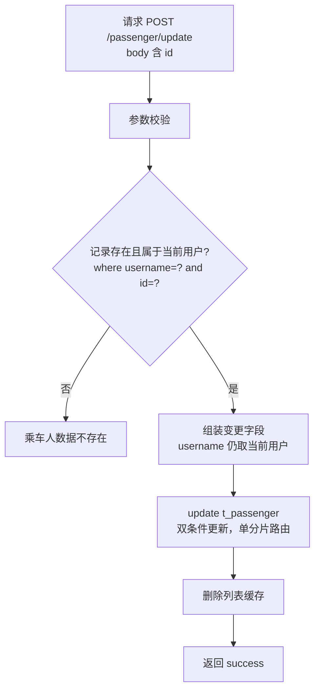
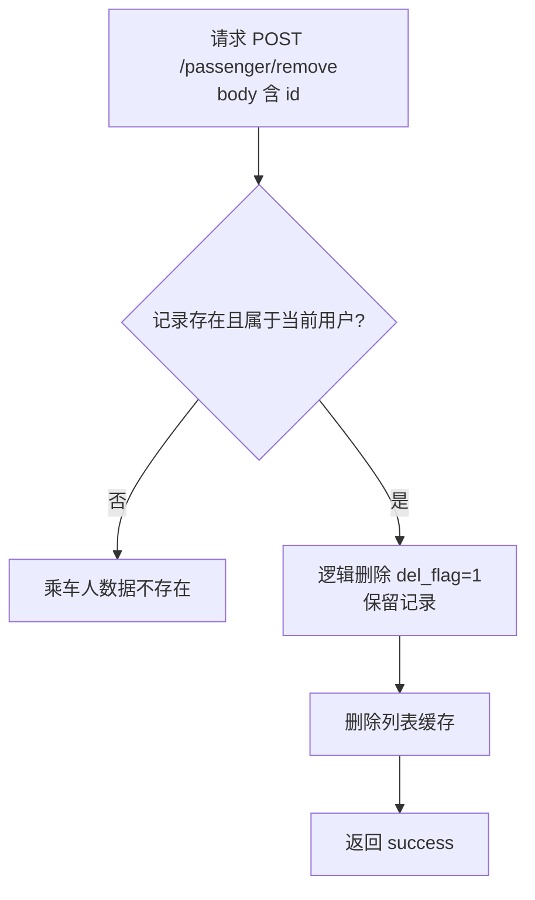

# 乘车人管理功能分析与设计

> 定位：以"乘车人管理"为载体，示范 **功能分析 → 数据设计 → 接口设计 → 业务流程** 的完整设计过程，并说明"一份功能分析文档该怎么写"。本文是分析与设计稿（不是实现指导），以原项目（nageoffer/12306 user-service）完整设计为主，同时标注学习项目 my12306 的现状与 v1/v2 边界。
>
> 事实来源：原项目 `PassengerController`、`PassengerServiceImpl`、`PassengerDO`、`shardingsphere-config.yaml`（user-service）、建表脚本 `12306-springcloud-user.sql`，以及本仓库《12306学习开发文档.md》乘车人章节。

---

## 〇、功能分析的方法论（怎么"想清楚"一个功能）

动手写代码前，功能分析要回答五类问题：

1. **做什么**：功能清单，每个功能一句话说清；
2. **边界在哪**：谁是操作者、能操作哪些数据、不能操作什么；
3. **规则是什么**：必填、格式、唯一性、状态流转、敏感信息怎么处理；
4. **和谁联动**：依赖哪些已有功能，又会被哪些未来功能依赖；
5. **异常与非功能**：未登录、越权、重复提交、数据不存在、性能要求。

对应的产出物是：功能清单、业务规则表、边界/异常清单、关联功能图、设计决策记录。本文接下来就按这个模板展开乘车人管理。

---

## 一、功能分析（乘车人管理）

### 1.1 需求背景与目标

12306 的业务模型里有两类"人"：

- **会员（账号）**：注册登录的本人，一个账号一套凭证；
- **乘车人（档案）**：购票时实际坐车的人，由会员维护在自己名下，可以不是会员本人（帮家人买票）。

乘车人管理要解决的问题：**让会员维护一份"实名乘车人档案"，购票时直接勾选，而不是每次重复录入证件信息**。它是实名制购票的基础数据，属于 user-service 域内、注册/登录/注销之后最自然的下一个功能。

一句话定位：**会员对自己名下的乘车人做增删改查，数据加密存储、对外脱敏展示，供后续购票链路按 ID 选择使用。**

### 1.2 功能清单

| 功能 | 一句话说明 | 使用方 |
| --- | --- | --- |
| 查询乘车人列表 | 返回当前登录用户名下的全部有效乘车人（脱敏） | 前端乘车人管理页、购票页候选列表 |
| 按 ID 集合查询 | 给定 username + ids，返回这些乘车人的**真实**证件/手机号 | 内部：购票服务下单时核验乘车人 |
| 新增乘车人 | 录入姓名/证件/优惠类型/手机号，加入本人名下 | 前端表单 |
| 修改乘车人 | 修改本人名下某乘车人的档案 | 前端表单 |
| 移除乘车人 | 将乘车人逻辑删除，不再出现在列表与购票候选 | 前端操作 |

### 1.3 业务规则

**归属规则（最重要的边界）**

- 列表/新增/修改/移除都只针对 **当前登录用户（UserContext.username）** 名下的数据；
- 修改、移除、按 ID 查询必须带 username 归属校验，条件写成 `username = ? AND id = ?`，防止越权操作他人乘车人；
- 未登录（UserContext 无 username）直接拒绝。

**字段规则（新增/修改共用）**

| 字段 | 必填 | 规则 |
| --- | --- | --- |
| realName 真实姓名 | 是 | 长度 2~16（原项目：`乘车人名称请设置2-16位的长度`） |
| idType 证件类型 | 是 | 枚举（身份证=1 等，与注册证件类型口径一致） |
| idCard 证件号码 | 是 | 合法证件号校验（原项目用 hutool `IdcardUtil.isValidCard`，失败文案：`乘车人证件号错误`） |
| discountType 优惠类型 | 否 | 成人/儿童/学生等，枚举待定 |
| phone 手机号 | 是 | 手机号格式校验（原项目用 hutool `PhoneUtil.isMobile`，失败文案：`乘车人手机号错误`） |

**状态与数据规则**

- 新增时 `verify_status` 默认"已审核"（REVIEWED=1）、`create_date` 记为当天——原项目新增即通过审核；
- **移除不是物理删除**：`del_flag = 1` 置位，记录保留（历史购票依据）；
- 查询只返回 `del_flag = 0` 的有效乘车人（MyBatis-Plus 逻辑删除自动追加条件）；
- 操作不存在的记录统一文案：`乘车人数据不存在`；
- 敏感字段：`id_card`、`phone` **加密落库**（沿用 AES 配置），对外接口返回**脱敏**值，只有内部接口返回明文。

### 1.4 关联功能

- **登录态/UserContext**：所有接口的身份来源，与注销功能同一套机制；
- **注册实名信息**：乘车人证件/手机号校验与注册参数校验可复用同一套思路与正则口径；
- **注销**：账号注销后，其名下乘车人数据如何处置（保留审计 vs 一并置位）需要与注销流程联动决策；
- **购票（未来批次）**：购票下单时调用"按 ID 集合查询"拿真实实名信息去核验/出票——这是本功能存在的最终目的；
- **分库分表与加密（v2-sharding 现状）**：t_passenger 需要加入分片规则与加密规则，见第三节。

### 1.5 边界与异常场景

| 场景 | 期望行为 |
| --- | --- |
| 未登录调用 | 拒绝（UserContext 无用户） |
| 修改/移除他人名下乘车人 | 查不到记录，返回"乘车人数据不存在"（用 username+id 双条件天然挡掉） |
| 重复提交新增/修改/移除（双击） | 幂等/防抖：原项目用幂等注解按 username 防重；my12306 v1 可先用分布式锁简化 |
| 同一用户名下重复证件 | **待细化**：原项目数据库没有唯一约束，防重复依赖应用层判断与幂等 |
| 移除已被移除的记录 | 视为不存在，返回"乘车人数据不存在" |
| 列表为空 | 返回空列表或 null（原项目缓存实现返回 null，v1 直查建议返回空列表，见 5.4） |

---

## 二、数据设计

### 2.1 t_passenger 表设计（对照原项目）

| 字段 | 类型 | 说明 | 加密 |
| --- | --- | --- | --- |
| id | bigint unsigned | 主键，应用侧雪花 ID（分库后不能依赖自增） | 否 |
| username | varchar(256) | 归属会员用户名，**分片键** | 否 |
| real_name | varchar(128) | 真实姓名 | 否 |
| id_type | int | 证件类型 | 否 |
| id_card | varchar(256) | 证件号码 | **是（AES）** |
| discount_type | int | 优惠类型（成人/儿童/学生…） | 否 |
| phone | varchar(128) | 手机号 | **是（AES）** |
| create_date | datetime | 添加日期（业务日期，与 create_time 公共字段区分） | 否 |
| verify_status | int | 审核状态：0=未审核 1=已审核 | 否 |
| create_time / update_time / del_flag | datetime / tinyint | 公共字段（BaseDO），del_flag 逻辑删除 | 否 |

索引（原项目 DDL）：

- `PRIMARY KEY (id)`；
- `idx_username (username)`：所有查询都带 username，且 username 是分片键；
- `idx_id_card (id_card)`：原项目保留的索引。**注意**：id_card 落库是密文，明文等值查询能否命中该索引取决于加密是否确定性，这是一个值得展开的待细化问题（见 5.2）。

### 2.2 为什么 t_passenger 按 username 分片（而不是 id）

这是本节最重要的设计决策，与 t_user 的分片思路一致：

1. **访问模式决定分片键**：乘车人所有操作都从"当前登录用户"出发（列表查 username、改/删带 username+id）。按 username 分片后，每次查询都能算出唯一分片，单分片路由；
2. **与 t_user 同分片键 = 同库亲和**：某个用户的账号与他的乘车人落在同一个物理库/分片组，未来"查用户 + 查他的乘车人"的关联读取不跨库；
3. **为什么不能用 id 分片**：乘车人 id 是全局唯一的雪花 ID，无法表达"属于谁"；按 id 分片后，列表查询（只有 username）就必须广播到所有分片。

代价也要知道：**跨用户查询（如全局按证件号找人）会全分片广播**——但业务上不存在这种查询，所以可接受。

### 2.3 分片与加密配置（对齐 my12306 v2-sharding）

原项目 user-service 的 `shardingsphere-config.yaml` 中 t_passenger 的配置要点：

- `actualDataNodes: ds_${0..1}.t_passenger_${0..31}`：2 库 × 32 片；
- 分片键 username，库/表各配一个哈希取模算法；
- 加密列 `id_card`、`phone`（cipherColumn 与逻辑列同名），`queryWithCipherColumn: true`。

my12306 当前 v2-sharding 分支的 yaml 是 **ShardingSphere 5.5.2**，规则写法与原项目 5.3 有两个差异，落地时需按现有风格扩展：

- 分片算法一律用 `CLASS_BASED`（5.5 手动分片表不允许 HASH_MOD），可直接复用现有 `CustomDbHashModShardingAlgorithm`（库算法 `table-sharding-count: 16`、表算法 `1`）；
- 加密列用嵌套结构：`id_card: { cipher: { name: id_card, encryptorName: common_encryptor } }`。

实体 `PassengerDO` 逻辑表名 `t_passenger`，与 t_user 一样继承 BaseDO；MyBatis-Plus 透明路由，Mapper 无需感知分片。

### 2.4 与 t_user 表设计的对比（学习点）

| 维度 | t_user（会员主表） | t_passenger（乘车人表） |
| --- | --- | --- |
| 归属 | 自身即账号主体 | username 归属某个会员 |
| 分片键 | username | username（同键同库） |
| 证件号 | 全局唯一（注册时查重/黑名单） | **同用户名下**业务上应唯一，但原项目无 DB 唯一约束 |
| 加密 | id_card/phone/mail/address | id_card/phone |
| 注销 | deletion_time 置位 + 复用记录 | 移除用 del_flag；账号注销后处置待定 |
| 列表读取 | 单条按 username 定位 | 一用户多条，需要列表/筛选 |

### 2.5 待细化问题（数据层）

- 同一用户名下证件号重复添加如何拦截：应用层先查后插？加密辅助列？依赖幂等？（见 5.2）
- `idx_id_card` 在加密后是否还有意义，明文等值查询与密文索引的取舍；
- 乘车人数上限（真实 12306 有上限，如 10~15 人），要不要限制、超限文案；
- `discount_type`、`id_type` 的枚举口径与注册/购票侧是否统一。

---

## 三、接口设计

### 3.1 接口清单（对照原项目 PassengerController）

| 方法 | 路径 | 入参 | 出参 | 说明 |
| --- | --- | --- | --- | --- |
| GET | /api/user-service/passenger/query | 无（username 取自 UserContext） | List\<PassengerRespDTO\> | 当前用户乘车人列表（证件/手机号**脱敏**） |
| GET | /api/user-service/inner/passenger/actual/query/ids | username、ids | List\<PassengerActualRespDTO\> | 内部接口：按 ID 集合返回**明文**实名信息 |
| POST | /api/user-service/passenger/save | PassengerReqDTO | Result\<Void\> | 新增乘车人 |
| POST | /api/user-service/passenger/update | PassengerReqDTO（含 id） | Result\<Void\> | 修改乘车人 |
| POST | /api/user-service/passenger/remove | PassengerRemoveReqDTO（id） | Result\<Void\> | 移除乘车人（逻辑删除） |

> 更正一处：早期路线图文档里写的 `/passenger/remote` 是笔误，原项目实际路径是 `/passenger/remove`。

### 3.2 DTO 设计要点

**PassengerReqDTO（新增/修改共用）**：`id`（String，修改时必填）、`realName`、`idType`、`idCard`、`discountType`、`phone`。

**PassengerRemoveReqDTO**：`id`。

**PassengerRespDTO（对外列表，脱敏）**：`id`、`username`、`realName`、`idType`、脱敏后的 `idCard`/`phone`、`discountType`、`createDate`、`verifyStatus`。

**PassengerActualRespDTO（内部，明文）**：字段同列表，但 `idCard`/`phone` 为真实值。

**两套响应为什么要分开**：

- 面向前端/用户的列表只给脱敏值（证件号保留前 4 后 4、手机号中间打码），避免敏感信息扩散；
- 购票链路需要真实证件号去实名核验，所以提供 `inner` 内部接口返回明文。实现上原项目给 PassengerRespDTO 的 idCard/phone 加了 Jackson 自定义序列化器（`IdCardDesensitizationSerializer`、`PhoneDesensitizationSerializer`），序列化时自动脱敏。

> 设计提醒：`/inner/` 接口是"明文出口"，在真实系统里应受网关/内网隔离保护，不能当普通用户接口暴露。my12306 目前没有网关，落地时要在文档里明确它的调用方只有未来购票服务（v2 可再加内部鉴权）。

### 3.3 校验与错误文案

- 参数校验：realName 长度、证件号合法、手机号格式（原项目在 Service 层用 hutool 校验，失败文案见 1.3）；
- 归属校验：username 一律取自 UserContext，请求体**不接收** username（防伪造）；
- 越权/不存在：统一"乘车人数据不存在"；
- 幂等提示：原项目新增/修改/移除用幂等注解，message 为"正在新增/修改/移除乘车人，请稍后再试..."。

### 3.4 待细化问题（接口层）

- id 用 String 还是 Long：原项目 DTO 用 String（雪花 ID 精度），服务查询时再转；my12306 的注册/登录接口 userId 也是 String，口径需统一；
- inner 接口的入参 ids 上限与"ids 中混入他人乘车人 id"如何兜底（按 username 过滤天然解决）；
- 校验前移到 DTO（jakarta @Valid）还是留在 Service：my12306 现有风格是 DTO 注解 + 责任链，乘车人功能建议沿用，但证件号"合法校验"（如 18 位校验位）需要自定义，可先做基础格式再细化。

---

## 四、业务流程

### 4.1 新增乘车人

```mermaid
flowchart TD
    A[请求 POST /passenger/save] --> B{@Valid/参数校验}
    B -- 失败 --> B1[返回参数错误]
    B -- 通过 --> C{UserContext 已登录?}
    C -- 否 --> C1[拒绝：未登录]
    C -- 是 --> D[username = 当前用户]
    D --> E[查重：同用户名下同证件是否已存在]
    E -- 已存在 --> E1[提示重复（待细化策略）]
    E -- 不存在 --> F[组装 PassengerDO<br/>verifyStatus=REVIEWED, createDate=当天]
    F --> G[insert t_passenger<br/>ShardingSphere 按 username 路由 + 证件/手机号加密落库]
    G --> H[删除该用户乘车人列表缓存]
    H --> I[返回 success]
```

### 4.2 修改乘车人



### 4.3 移除乘车人



### 4.4 列表查询与内部按 ID 查询

**列表查询（对外）**：username → （v2 缓存：`user-passenger-list:{username}`，TTL 1 天，未命中回源 DB）→ 查 t_passenger `del_flag=0` → 转 PassengerRespDTO（脱敏）返回。

**按 ID 集合查询（内部）**：原项目实现值得注意——它**不直接按 ids 查库**，而是先取该用户列表缓存/DB 数据，再在内存里用 `ids.contains(passenger.getId())` 过滤。这样既保证"只返回属于该 username 的乘车人"，又少一次 DB 访问。缺点是乘客很多时全量拉取；my12306 若不想依赖缓存，可直接 `where username=? and id in (ids)`，语义等价且更直接（见 5.4 方案对比）。

### 4.5 与注册/注销的联动（边界说明）

- 新增乘车人**不创建账号**，也不进入 t_user_phone/t_user_mail 映射体系——乘车人没有登录能力；
- 账号注销时，其名下乘车人当前**不随账号一起置位**（原项目未联动）；是否"注销后列表清空/购票不可选"属于待细化决策，需与注销流程一起评审。

---

## 五、难点与设计决策

### 5.1 分片键为什么选 username（决策要点）

同 2.2：访问模式 + 与 t_user 同库亲和 + 避免广播。学习时可以和"按 id 分片""按 id_card 分片"两个反例对比，理解"分片键由查询入口决定，而不是由主键决定"。

### 5.2 证件号/手机号加密后，怎么防"同人重复添加"

问题链：t_passenger 的 id_card/phone 落库即密文 → 数据库无法对明文做普通唯一约束 → "同一用户名下同证件只能有一个"要靠应用层保证。

候选方案（选型待细化，原项目并未在 DB 层解决）：

1. **应用层先查后插 + 幂等防抖**：新增前按 username 查列表判断证件是否已存在；并发双击靠幂等/锁兜底。缺点：不是绝对并发安全；
2. **确定性加密下的密文等值查询**：AES 确定性加密（同一明文→同一密文）时，`where id_card = ?` 会先加密再比较，理论上可命中密文索引。原项目保留 `idx_id_card` 且 `queryWithCipherColumn: true`，就是这个思路的痕迹；需要确认所选加密算法是否确定性；
3. **证件哈希辅助列**：新增 `id_card_hash` 列存不可逆哈希（可加盐），用它做唯一索引/等值查询。最稳，但要改表与写入逻辑。

学习建议：v1 先用方案 1（查询 + 锁），把方案 2/3 作为 v2 升级点写进待细化清单，不要在 v1 就把加密索引问题做死。

### 5.3 脱敏与"明文内部接口"怎么共存

- 对外列表：Jackson 自定义序列化器在出参时脱敏（证件保留前 4 后 4、手机号 `138****1234`），业务代码无感；
- 内部接口：独立 DTO（PassengerActualRespDTO）返回明文，路径带 `/inner/`，调用方限定为服务间调用。
- 设计取舍：脱敏放在"序列化层"（原项目）而不是"业务层"，好处是查询/缓存/日志都走明文、只有 HTTP 出口变脱敏；坏处是明文会短暂存在于内存与日志风险面，需配合日志脱敏规范。

### 5.4 列表缓存要不要做（v1/v2 边界）

原项目做法：Cache Aside——`user-passenger-list:{username}` 缓存 1 天，`safeGet` 未命中回源 DB 并回填；新增/修改/移除后主动删除该 key。内部按 ID 查询直接复用这份缓存做内存过滤。

**为什么原项目敢缓存列表**：列表是"当前用户只读自己"的数据，缓存 key 天然按用户隔离；写操作频率低（增删改才失效一次），一致性容易保证。

**my12306 v1 建议先不做缓存**：单机学习环境、数据量小，直查 DB（username 分片单路由）已足够；缓存引入的穿透、回填、失效顺序问题留到 v2 与本模块的"Redis 使用"一起系统学习。列表为空时 v1 返回空列表，比原项目"返回 null"更友好。

### 5.5 幂等与防抖

新增/修改/移除都可能被前端双击或网络重试触发。原项目用框架级 `@Idempotent`（key 取 username，message"正在新增乘车人，请稍后再试..."）。my12306 没有幂等组件，v1 可用 Redisson 锁按 `lock:user-passenger-alter:{username}` 串行写操作（复用注册/注销的锁思路）；参数级幂等（同一次提交只生效一次）作为 v2 待细化。

### 5.6 逻辑删除与列表可见性

移除 = `del_flag=1`，MyBatis-Plus 自动让列表/购票候选不可见；记录保留供历史订单追溯。注意与 t_user 注销的差别：乘车人移除**不释放任何唯一键、不做复用**，比账号注销简单得多——这也是为什么不需要 deletion_time 联合唯一索引那一套。

---

## 六、my12306 现状与实施前核对

### 6.1 已就绪、可直接复用的基础设施

（对照 v2-sharding 分支，`services/user-services` 模块）

| 能力 | 位置 | 乘车人功能如何复用 |
| --- | --- | --- |
| 统一响应/异常 | common/Result、GlobalExceptionHandler | 接口直接返回 Results.success |
| 登录用户上下文 | common/UserContext + UserTransmitFilter | 列表/新增/修改/移除取 username |
| 逻辑删除与公共字段 | application.yml + MyMetaObjectHandler + BaseDO | del_flag/create_time 自动处理 |
| 密码/校验基建 | PasswordConfig（本次不用）、jakarta 校验 | 乘车人参数校验沿用注解风格 |
| 分库分表 | shardingsphere-config.yaml + CustomDbHashModShardingAlgorithm | 需新增 t_passenger 规则（5.5 嵌套加密格式） |
| AES 加密 | 同上 !ENCRYPT | 复用 common_encryptor |
| 雪花主键 | MyBatis-Plus 默认 ASSIGN_ID | PassengerDO.id 自动生成 |
| Redis/锁 | RedisKeyConstant + Redisson | v1 防抖锁、v2 列表缓存 |

### 6.2 需要新增的内容（实施范围，仅列不展开）

- 数据层：`PassengerDO`（@TableName t_passenger）、`PassengerMapper`（继承 BaseMapper，无自定义 SQL 即可）、两张库的 `t_passenger_0..31` 物理表（沿用现有 DDL 字段，共 64 张）；
- 配置层：shardingsphere-config.yaml 增加 t_passenger 分片表 + 加密列（id_card/phone）；
- DTO：PassengerReqDTO / PassengerRemoveReqDTO / PassengerRespDTO / PassengerActualRespDTO；
- 业务层：PassengerService + 实现（列表、按 ids、新增、修改、移除）；
- 控制层：PassengerController 5 个接口；内部接口路径 `/inner/...` 明确仅供未来购票服务调用；
- 校验：姓名长度、证件号格式、手机号格式（可先复用注册手机号正则，证件校验用基础长度+格式，校验位规则列为细化）。

### 6.3 与原项目的差异提示

- 原项目把参数校验放 Service（hutool），my12306 风格是 DTO 注解 + 自定义校验，二选一并保持一致即可；
- 原项目新增/修改/移除带幂等注解与列表缓存，v1 简化为"锁 + 直查"；
- 原项目列表返回 null、内部按 ids 走缓存内存过滤，v1 直查 DB（列表空返回空数组、内部接口 where username + in ids）。

---

## 七、学习自测清单

按"功能分析 / 数据设计 / 接口 / 流程 / 决策"五块自测，能独立讲清才算过关：

1. 乘车人和会员在业务上是什么关系？为什么乘车人不需要登录能力？
2. 为什么所有写操作都不允许请求体传 username？（防越权的第一道关）
3. 修改/移除用 `username + id` 双条件，解决了什么问题？只按 id 会怎样？
4. t_passenger 为什么按 username 分片？如果按 id 分片，列表查询会发生什么？
5. 为什么乘车人移除不需要 deletion_time 那一套"唯一键让位"设计？
6. id_card/phone 加密后，同用户名重复证件靠什么防？三个候选方案各自的优缺点？
7. 对外列表脱敏、内部接口给明文，两种数据出口为什么必须分开？`/inner/` 路径的风险是什么？
8. 列表缓存为什么按 username 做 key？写操作后做什么才能保证一致性？（Cache Aside）
9. 新增与修改为什么共用 PassengerReqDTO？id 字段的"新增可不传、修改必传"怎么校验？
10. 如果账号注销了，他名下的乘车人应该怎么办？说出你的方案与理由（开放题）。

---

## 附：参考来源

- 原项目：`datasource/originalProject/12306/services/user-service` 下 PassengerController、PassengerService(Impl)、PassengerDO、PassengerMapper、dto/req 与 dto/resp、serialize 脱敏序列化器、shardingsphere-config.yaml（t_passenger 分片与加密段）、VerifyStatusEnum、RedisKeyConstant（USER_PASSENGER_LIST）；
- 建表脚本：`resources/db/12306-springcloud-user.sql`（t_passenger 字段与索引）；
- 本仓库：`docs/12306学习开发文档.md`（乘车人章节与开发路线图）、`docs/用户服务代码阅读指导.md`（v2-sharding 基础设施阅读指引）、`docs/注销功能分析与设计.md`（本文的写作模板）。
