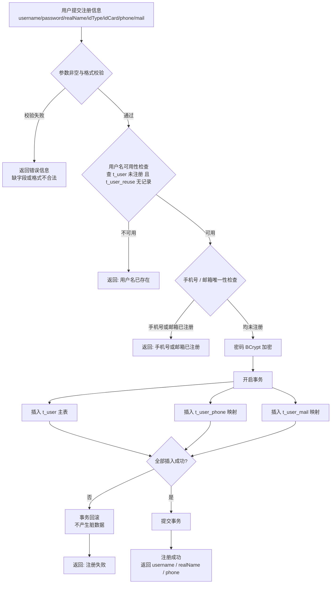
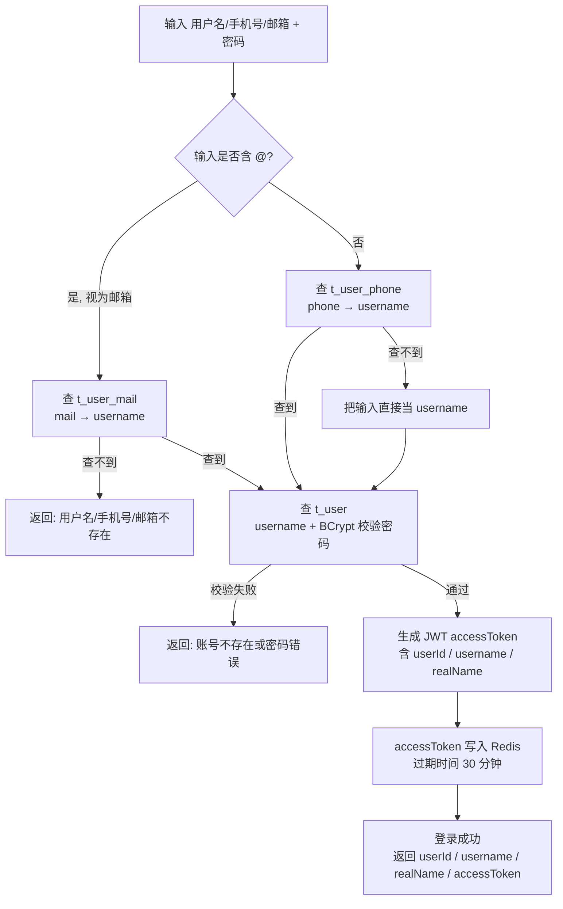
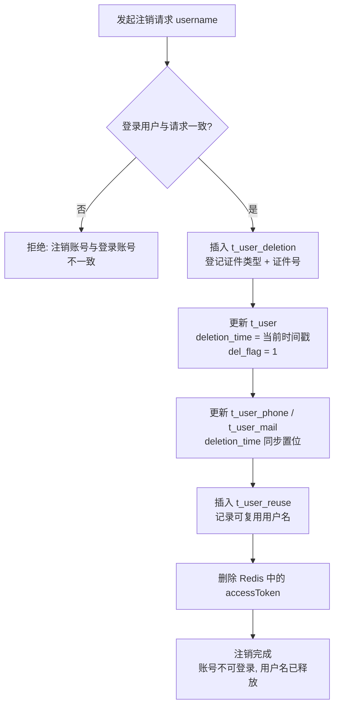

# 注册登录注销 v1 业务流程图与数据库设计

> 本文档是 v1 版本的开发前设计稿，定位：**先跑通「注册 → 登录 → 注销」最小闭环**。
>
> v1 原则：
> - **不分库分表**：每张逻辑表建单表，表名、字段、唯一性机制按项目方向设计，为后续扩展预留空间。
> - **基础功能优先**：只实现注册、登录、注销三个功能；分库分表、布隆过滤器、分布式锁、AES 加密等优化列为 v2，仅在设计上预留。
> - **生产向基础规范**：密码使用 BCrypt 哈希存储；登录态使用 JWT + Redis（30 分钟过期）。

---

## 一、v1 设计目标与范围

**目标**：实现一个可运行的账号闭环——用户注册成为会员 → 通过用户名/手机号/邮箱登录 → 使用后注销账号（用户名释放、可被再次注册）。

**范围内**：

- 注册（含唯一性校验）
- 登录（三种身份识别 + 密码校验 + Token 签发）
- 登出（退出登录）
- 注销（账号注销，非物理删除）

**范围外（v2 再做）**：

- 分库分表、读请求扩散的映射表分片
- 布隆过滤器防缓存穿透、Redis 复用集合
- 分布式锁控制并发
- 敏感字段 AES 加密
- 证件号注销黑名单（>= 5 次拒绝注册）

---

## 二、业务流程图

### 2.1 注册流程

**接口**：`POST /api/user-service/register`

**v1 校验顺序**：参数非空/格式 → 用户名可用性 → 手机号/邮箱唯一性 → 插入数据。



**关键规则**：

- 用户名、手机号、邮箱唯一性由**数据库唯一索引**兜底，先查后插只是提前给出友好提示（见第三节表设计）。
- 密码入库前 BCrypt 加密，任何日志、响应不得出现明文密码。
- 注册成功即建立 phone/mail → username 的映射关系，为后续登录、分库分表做准备。

> **v2 优化点**：用户名可用性检查改为「布隆过滤器 + Redis 复用集合」，避免高并发注册时的缓存穿透；注册加分布式锁防止并发重复注册。

### 2.2 登录流程

**接口**：`POST /api/user-service/v1/login`

**v1 识别顺序**：输入含 `@` 视为邮箱 → 否则先按手机号查 → 查不到则当用户名处理。



**关键规则**：

- 三种身份统一入口，系统自动识别类型后先经映射表收敛到 username，再查主表。
- 密码校验用 BCrypt `matches` 比对密文，不比对明文。
- 登录成功将 accessToken 缓存 Redis 30 分钟；登出（`GET /api/user-service/logout`）即删除该缓存；`check-login` 即查该缓存。

> **v2 优化点**：映射表按 phone/mail 分片，使"手机号/邮箱 → username"的查询收敛到单分片，避免读请求扩散；Token 增加刷新机制。

### 2.3 注销流程

**接口**：`POST /api/user-service/deletion`

**v1 语义**：账号不可用 + 用户名释放可复用，**数据不物理删除**。



**关键规则**：

- 注销只做"置位 + 登记"，不删除数据，保留审计痕迹。
- `deletion_time` 置位后，`(username, deletion_time)` 唯一索引自动让位，同名可重新注册；phone/mail 同理。
- `t_user_reuse` 记录可复用用户名，注册时的可用性检查需要同时看主表与复用表。

> **v2 优化点**：注销加分布式锁保证并发一致；注销次数 >= 5 的证件号进入黑名单拒绝注册；复用用户名写入 Redis 分片集合加速查询。

---

## 三、数据库设计

### 3.1 设计原则

1. **单表**：v1 每张逻辑表只建一张物理表，不分片。
2. **表名与项目一致**：表名沿用项目命名（t_user、t_user_phone…），后续引入分库分表时无需改名。
3. **公共字段统一**：每张表都带 `create_time`、`update_time`、`del_flag`（逻辑删除），由代码（MyBatis-Plus 自动填充）维护。
4. **唯一性靠联合唯一索引**：`(业务键, deletion_time)`，注销即释放。
5. **字段类型对齐项目**：类型与长度照项目脚本，仅 password 按 BCrypt 调整为 60。

### 3.2 表清单

| 表名 | 职责 | 分片键（v2 预留） |
| --- | --- | --- |
| t_user | 会员主表，账号 + 实名信息 | username |
| t_user_phone | 手机号 → 用户名映射 | phone |
| t_user_mail | 邮箱 → 用户名映射 | mail |
| t_user_reuse | 用户名复用记录（注销后可复用） | - |
| t_user_deletion | 注销登记（证件号黑名单依据） | - |

### 3.3 各表详解

#### t_user：会员主表

| 字段 | 类型 | 说明 | 备注 |
| --- | --- | --- | --- |
| id | bigint unsigned | 主键 | 自增或雪花 ID |
| username | varchar(256) | 用户名 | 分片键（v2） |
| password | varchar(60) | 密码 | BCrypt 密文，60 位 |
| real_name | varchar(256) | 真实姓名 | |
| region | varchar(64) | 国家/地区 | 默认 '0' |
| id_type | int | 证件类型 | |
| id_card | varchar(256) | 证件号码 | 敏感字段（v2 加密） |
| phone | varchar(128) | 手机号 | 敏感字段（v2 加密） |
| telephone | varchar(128) | 固定电话 | |
| mail | varchar(256) | 邮箱 | |
| user_type | int | 旅客类型 | |
| verify_status | int | 实名核验状态 | |
| post_code | varchar(64) | 邮编 | |
| address | varchar(1024) | 地址 | 敏感字段（v2 加密） |
| deletion_time | bigint | 注销时间戳 | 默认 0；注销时置当前毫秒时间戳 |
| create_time / update_time / del_flag | datetime / tinyint | 公共字段 | 代码维护 |

**索引**：`UNIQUE KEY idx_username (username, deletion_time)`

**设计理由**：

- 用户名与注销时间组成联合唯一索引——未注销（deletion_time=0）时用户名唯一；注销后时间戳变化，唯一索引让位，同名可重新注册。这是"注销不物理删除、用户名可复用"的落点。
- password 定长 60，正好容纳 BCrypt 输出。

#### t_user_phone：手机号映射表

| 字段 | 类型 | 说明 |
| --- | --- | --- |
| id | bigint | 主键 |
| username | varchar(256) | 归属会员用户名 |
| phone | varchar(128) | 手机号 |
| deletion_time | bigint | 注销时间戳（默认 0） |
| create_time / update_time / del_flag | datetime / tinyint | 公共字段 |

**索引**：`UNIQUE KEY idx_phone (phone, deletion_time)`

**设计理由**：支撑"手机号登录"与"手机号唯一性"。登录时按 phone 查到 username，再查主表；注销时同步置位 deletion_time 释放手机号。

#### t_user_mail：邮箱映射表

| 字段 | 类型 | 说明 |
| --- | --- | --- |
| id | bigint | 主键 |
| username | varchar(256) | 归属会员用户名 |
| mail | varchar(256) | 邮箱 |
| deletion_time | bigint | 注销时间戳（默认 0） |
| create_time / update_time / del_flag | datetime / tinyint | 公共字段 |

**索引**：`UNIQUE KEY idx_mail (mail, deletion_time)`

**设计理由**：与 t_user_phone 同构，支撑"邮箱登录"与"邮箱唯一性"。

#### t_user_reuse：用户名复用表

| 字段 | 类型 | 说明 |
| --- | --- | --- |
| id | bigint | 主键 |
| username | varchar(256) | 已注销、可复用的用户名 |
| create_time / update_time / del_flag | datetime / tinyint | 公共字段 |

**索引**：`KEY idx_username (username)`

**设计理由**：登记"已注销、可复用"的用户名，是注册时可用性检查的可靠依据（v1 直接查库；v2 配合 Redis 分片集合加速）。

#### t_user_deletion：注销登记表

| 字段 | 类型 | 说明 |
| --- | --- | --- |
| id | bigint | 主键 |
| id_type | int | 证件类型 |
| id_card | varchar(256) | 证件号码 |
| create_time / update_time / del_flag | datetime / tinyint | 公共字段 |

**设计理由**：每次注销登记证件号，v2 按证件号统计注销次数（>= 5 拒绝注册）形成黑名单；v1 仅做登记。

### 3.4 用户名释放机制说明

```
注册:   t_user(username, deletion_time=0)          → 唯一，正常使用
注销:   t_user.deletion_time = 当前时间戳           → 唯一索引让位
        t_user_reuse 插入 username                 → 标记可复用
再注册: 可用性检查通过（主表无此 username 且复用表有记录也算可用）
        插入新 t_user(username, deletion_time=0)    → 复用成功
```

phone / mail 的释放逻辑完全相同，只是作用在各自的映射表上。

---

## 四、建表 SQL（MySQL 8）

```sql
-- 会员主表
CREATE TABLE `t_user` (
  `id`            bigint(20) unsigned NOT NULL AUTO_INCREMENT COMMENT 'ID',
  `username`      varchar(256) COLLATE utf8mb4_unicode_ci DEFAULT NULL COMMENT '用户名',
  `password`      varchar(60) COLLATE utf8mb4_unicode_ci DEFAULT NULL COMMENT '密码(BCrypt)',
  `real_name`     varchar(256) COLLATE utf8mb4_unicode_ci DEFAULT NULL COMMENT '真实姓名',
  `region`        varchar(64) COLLATE utf8mb4_unicode_ci DEFAULT '0' COMMENT '国家/地区',
  `id_type`       int(3) DEFAULT NULL COMMENT '证件类型',
  `id_card`       varchar(256) COLLATE utf8mb4_unicode_ci DEFAULT NULL COMMENT '证件号',
  `phone`         varchar(128) COLLATE utf8mb4_unicode_ci DEFAULT NULL COMMENT '手机号',
  `telephone`     varchar(128) COLLATE utf8mb4_unicode_ci DEFAULT NULL COMMENT '固定电话',
  `mail`          varchar(256) COLLATE utf8mb4_unicode_ci DEFAULT NULL COMMENT '邮箱',
  `user_type`     int(3) DEFAULT NULL COMMENT '旅客类型',
  `verify_status` int(3) DEFAULT NULL COMMENT '审核状态',
  `post_code`     varchar(64) COLLATE utf8mb4_unicode_ci DEFAULT NULL COMMENT '邮编',
  `address`       varchar(1024) COLLATE utf8mb4_unicode_ci DEFAULT NULL COMMENT '地址',
  `deletion_time` bigint(20) DEFAULT '0' COMMENT '注销时间戳',
  `create_time`   datetime DEFAULT NULL COMMENT '创建时间',
  `update_time`   datetime DEFAULT NULL COMMENT '修改时间',
  `del_flag`      tinyint(1) DEFAULT NULL COMMENT '删除标识',
  PRIMARY KEY (`id`),
  UNIQUE KEY `idx_username` (`username`, `deletion_time`) USING BTREE
) ENGINE=InnoDB DEFAULT CHARSET=utf8mb4 COLLATE=utf8mb4_unicode_ci COMMENT='用户表';

-- 用户号码映射表
CREATE TABLE `t_user_phone` (
  `id`            bigint(20) NOT NULL AUTO_INCREMENT COMMENT 'ID',
  `username`      varchar(256) COLLATE utf8mb4_unicode_ci DEFAULT NULL COMMENT '用户名',
  `phone`         varchar(128) COLLATE utf8mb4_unicode_ci DEFAULT NULL COMMENT '手机号',
  `deletion_time` bigint(20) DEFAULT '0' COMMENT '注销时间戳',
  `create_time`   datetime DEFAULT NULL COMMENT '创建时间',
  `update_time`   datetime DEFAULT NULL COMMENT '修改时间',
  `del_flag`      tinyint(1) DEFAULT NULL COMMENT '删除标识',
  PRIMARY KEY (`id`),
  UNIQUE KEY `idx_phone` (`phone`, `deletion_time`) USING BTREE
) ENGINE=InnoDB DEFAULT CHARSET=utf8mb4 COLLATE=utf8mb4_unicode_ci COMMENT='用户号码表';

-- 用户邮箱映射表
CREATE TABLE `t_user_mail` (
  `id`            bigint(20) NOT NULL AUTO_INCREMENT COMMENT 'ID',
  `username`      varchar(256) COLLATE utf8mb4_unicode_ci DEFAULT NULL COMMENT '用户名',
  `mail`          varchar(256) COLLATE utf8mb4_unicode_ci DEFAULT NULL COMMENT '邮箱',
  `deletion_time` bigint(20) DEFAULT '0' COMMENT '注销时间戳',
  `create_time`   datetime DEFAULT NULL COMMENT '创建时间',
  `update_time`   datetime DEFAULT NULL COMMENT '修改时间',
  `del_flag`      tinyint(1) DEFAULT NULL COMMENT '删除标识',
  PRIMARY KEY (`id`),
  UNIQUE KEY `idx_mail` (`mail`, `deletion_time`) USING BTREE
) ENGINE=InnoDB DEFAULT CHARSET=utf8mb4 COLLATE=utf8mb4_unicode_ci COMMENT='用户邮箱表';

-- 用户名复用表
CREATE TABLE `t_user_reuse` (
  `id`          bigint(20) NOT NULL AUTO_INCREMENT COMMENT 'ID',
  `username`    varchar(256) COLLATE utf8mb4_unicode_ci DEFAULT NULL COMMENT '用户名',
  `create_time` datetime DEFAULT NULL COMMENT '创建时间',
  `update_time` datetime DEFAULT NULL COMMENT '修改时间',
  `del_flag`    tinyint(1) DEFAULT NULL COMMENT '删除标识',
  PRIMARY KEY (`id`),
  KEY `idx_username` (`username`) USING BTREE
) ENGINE=InnoDB DEFAULT CHARSET=utf8mb4 COLLATE=utf8mb4_unicode_ci COMMENT='用户名复用表';

-- 用户注销登记表
CREATE TABLE `t_user_deletion` (
  `id`          bigint(20) NOT NULL AUTO_INCREMENT COMMENT 'ID',
  `id_type`     int(3) DEFAULT NULL COMMENT '证件类型',
  `id_card`     varchar(256) COLLATE utf8mb4_unicode_ci DEFAULT NULL COMMENT '证件号',
  `create_time` datetime DEFAULT NULL COMMENT '创建时间',
  `update_time` datetime DEFAULT NULL COMMENT '修改时间',
  `del_flag`    tinyint(1) DEFAULT NULL COMMENT '删除标识',
  PRIMARY KEY (`id`)
) ENGINE=InnoDB DEFAULT CHARSET=utf8mb4 COLLATE=utf8mb4_unicode_ci COMMENT='用户注销表';
```

> 说明：`create_time` / `update_time` 由代码（MyBatis-Plus 自动填充）维护；id 可用自增或雪花算法，若后续分片建议改用雪花 ID。

---

## 五、v1 与项目 / 后续优化对照

| 方面 | v1 实现 | 项目做法 | 后续优化（v2+） |
| --- | --- | --- | --- |
| 分库分表 | 单表，不分片 | 用户域 2 库 × 16 表 = 32 片 | 引入 ShardingSphere，按 username/phone/mail 分片 |
| 密码存储 | BCrypt 哈希 | demo 为明文 | 已生产向，可升级密钥轮换 |
| 用户名可用性 | 直接查库（主表 + 复用表） | 布隆过滤器 + Redis Set 1024 分片 | v2 引入，防缓存穿透 |
| 注册并发 | 事务 + 唯一索引兜底 | + 分布式锁 | v2 加分布式锁 |
| 注销并发 | 简单流程 | + 分布式锁 | v2 加分布式锁 |
| 敏感字段 | 明文存储 | AES 加密（id_card/phone/mail/address） | v2 引入加密列 |
| 注销黑名单 | 仅登记 t_user_deletion | 统计 >= 5 次拒绝注册 | v2 实现，并加缓存 |
| 登录态 | JWT + Redis 30 分钟 | 同 | 已对齐，可加刷新机制 |
| 注销释放 | deletion_time 置位 + 复用表 | 同 + Redis 复用集合 | v2 加 Redis 集合 |

---

## 附：接口速查

| 功能 | 方法 | 路径 | 入参要点 | 出参要点 |
| --- | --- | --- | --- | --- |
| 注册 | POST | /api/user-service/register | username/password/realName/idType/idCard/phone/mail 等 | username/realName/phone |
| 登录 | POST | /api/user-service/v1/login | usernameOrMailOrPhone + password | userId/username/realName/accessToken |
| 登出 | GET | /api/user-service/logout | accessToken | 退出成功 |
| 登录态检查 | GET | /api/user-service/check-login | accessToken | 登录信息或空 |
| 用户名可用性 | GET | /api/user-service/has-username | username | 是否可用 |
| 注销 | POST | /api/user-service/deletion | username | 注销结果 |
