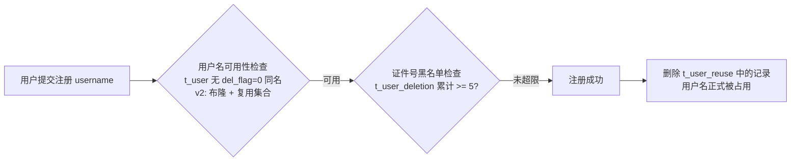

# 注销功能分析与设计（学习文档）

> 本文档以"注销"功能为载体，示范一份功能分析文档的完整写法：**功能分析 → 数据设计 → 业务流程**，并讲清每一步"在分析什么、为什么这样分析"。
>
> 定位：**分析与设计稿**，不是实现指导。内容以原项目完整设计为主，同时标注我们 my12306 的现状（数据层已就绪、Service/Controller 未实现）与 v1/v2 边界，供后续实现时对照。
>
> 事实来源：原项目 `UserLoginServiceImpl.deletion`、本地建表脚本、my12306 数据层代码、既有文档（注册登录注销 v1 流程图、用户表设计详解）。

---

## 〇、功能分析的方法论（先学会"怎么想"）

写任何功能分析文档前，先回答这 6 个问题：

| 问题 | 具体要分析什么 | 产出 |
| --- | --- | --- |
| 做什么 | 功能的目标、输入输出、主要动作 | 功能清单 |
| 边界在哪 | 什么算这个功能、什么不算；与相邻功能的划分 | 范围说明 |
| 规则是什么 | 业务约束：必填、唯一、状态、权限 | 业务规则表 |
| 和谁联动 | 依赖的前置功能、影响的下游功能 | 关联功能图 |
| 异常怎么办 | 非法输入、重复操作、并发、未登录 | 异常场景表 |
| 非功能要求 | 并发安全、性能、安全（敏感信息）、审计 | 非功能需求 |

分析顺序建议：**先写功能清单 → 再定业务规则 → 补边界与异常 → 最后画流程**。数据设计在功能分析基本稳定后再做，因为"表结构是为业务规则服务的"。

---

## 一、功能分析（注销）

### 1.1 需求背景与目标

**一句话目标**：用户注销账号后，账号立即不可用、登录态失效，但用户名/手机号/邮箱可以释放给后续新用户注册。

**为什么不能物理删除**：

- 账号关联订单、乘车人等历史数据，物理删除会破坏数据完整性（本项目尚未实现这些业务，但设计要预留）。
- 注销是敏感操作，需要保留审计痕迹（谁、什么证件、什么时候注销）。
- 物理删除后用户名直接可注册，容易被恶意"注册-注销-再注册"刷号。

所以注销的设计语义是：**置位（标记失效）+ 登记（留痕）+ 释放（三键可复用）**，而不是删除。

### 1.2 功能清单

| 功能 | 说明 | 涉及数据 |
| --- | --- | --- |
| 注销账号 | 账号标记为不可用（del_flag=1），无法再登录 | t_user |
| 释放用户名 | 注销后同名可注册（联合唯一索引让位） | t_user、t_user_reuse |
| 释放手机号/邮箱 | 注销后手机号/邮箱可被新账号绑定 | t_user_phone、t_user_mail |
| 登录态失效 | 注销后已签发的 token 立即作废 | Redis |
| 注销登记 | 记录注销用户的证件信息，形成黑名单依据 | t_user_deletion |

### 1.3 业务规则

| 规则 | 说明 |
| --- | --- |
| 必须登录 | 注销是本人操作，需要登录态（v1 用 accessToken 定位当前用户） |
| 只能注销本人 | 请求中的 username 必须等于当前登录用户名，否则拒绝 |
| 不物理删除 | 只置位 deletion_time / del_flag |
| 三键可复用 | 用户名、手机号、邮箱注销后均可被新账号使用 |
| 黑名单 | 同一证件号累计注销 >= 5 次，禁止再用该证件号注册 |
| 幂等 | 重复注销同一账号不应产生错误数据（第二次注销时账号已不可用，直接无效果） |

### 1.4 关联功能（联动）

```
注册 ──► 检查用户名可用（查 t_user + 复用记录） ──► 检查证件号黑名单（>=5 拒绝）
         └─ 注册成功后：删除复用记录（用户名正式被占用）

登录 ──► 登录态依赖 Redis token

注销 ──► 删除 token（登录态立即失效）
         ├─ 写入复用记录（用户名可再次注册）
         ├─ 登记证件号（黑名单累计）
         └─ 置位三表 deletion_time（唯一索引让位）
```

注销是"注册的逆过程 + 登录态的终结"：注册占用的资源，注销负责释放；登录签发的凭证，注销负责作废。

### 1.5 边界与异常场景

| 场景 | 处理 |
| --- | --- |
| 未登录直接调注销 | 拒绝（需要登录态，v1 需先补用户上下文） |
| 注销他人账号 | 返回"注销账号与登录账号不一致" |
| 重复注销 | 第二次注销时账号已 del_flag=1，置位 SQL 的 `del_flag='0'` 条件不命中，无副作用 |
| 并发注销同一账号 | 分布式锁保证串行，避免复用记录/置位状态错乱 |
| 注销时 Redis 不可用 | 删除 token 失败需考虑降级（v1 简化：先删后写，失败即报错回滚） |

---

## 二、数据设计

### 2.1 涉及表总览

| 表 | 职责 | 注销时做什么 | 分片键（v2） |
| --- | --- | --- | --- |
| t_user | 会员主表 | 置位 deletion_time + del_flag=1 | username |
| t_user_phone | 手机号映射 | 置位 deletion_time + del_flag=1 | phone |
| t_user_mail | 邮箱映射 | 置位 deletion_time + del_flag=1 | mail |
| t_user_reuse | 用户名复用记录 | 插入一条可复用记录 | - |
| t_user_deletion | 注销登记 | 插入证件信息 | - |

### 2.2 逐表设计

#### t_user：会员主表

| 字段 | 类型 | 注销中的作用 |
| --- | --- | --- |
| username | varchar(256) | 注销对象，更新条件 |
| deletion_time | bigint | **核心**：注销时置当前毫秒时间戳 |
| del_flag | tinyint(1) | 置 1（逻辑删除） |
| id_type / id_card | int / varchar | 查询后复制到注销登记表 |
| phone / mail | varchar | 查询后用于定位映射表记录 |

**索引**：`UNIQUE (username, deletion_time)`

#### t_user_phone / t_user_mail：映射表

| 字段 | 类型 | 作用 |
| --- | --- | --- |
| phone / mail | varchar | 更新条件 |
| deletion_time | bigint | 置当前毫秒时间戳 |
| del_flag | tinyint(1) | 置 1 |

**索引**：`UNIQUE (phone, deletion_time)`、`UNIQUE (mail, deletion_time)`

#### t_user_reuse：用户名复用表

| 字段 | 类型 | 作用 |
| --- | --- | --- |
| username | varchar(256) | 注销后记录"可复用" |

#### t_user_deletion：注销登记表

| 字段 | 类型 | 作用 |
| --- | --- | --- |
| id_type | int | 证件类型 |
| id_card | varchar(256) | 证件号，黑名单统计依据 |

### 2.3 核心机制

**1. 联合唯一索引如何"让位"**

```
注册:   t_user(username='a', deletion_time=0)          —— (a, 0) 唯一，正常使用
注销:   t_user(username='a', deletion_time=1788263...)  —— 唯一键变成 (a, 时间戳)，不再冲突
再注册: 新用户 t_user(username='a', deletion_time=0)     —— 复用成功
```

这就是"注销不物理删除 + 用户名可复用"的落点：**唯一性不是靠"用户名"，而是靠"用户名 + 注销时间"**。phone/mail 同理。

**2. 映射表为什么要同步置位**

手机号/邮箱登录依赖映射表查询（`del_flag=0` 条件）。注销时若不同步置位，被注销的手机号/邮箱仍能通过登录查到旧账号——所以三张表必须一起置位，且要放在同一个事务里。

**3. 复用表与布隆过滤器的关系（v2）**

- v1：用户名可用性直接查 `t_user (del_flag=0)`，复用表只作记录。
- v2（原项目）：可用性检查用布隆过滤器判断"一定不存在"；但布隆过滤器**不能删除元素**，注销后的用户名仍在过滤器里，所以用 Redis Set 存"已注销可复用"的用户名做补充判断。
- `t_user_reuse` 是数据库侧的**可靠事实源**（防 Redis 丢失）；Redis Set 是**快速查询副本**。

**4. 注销登记表的黑名单作用**

注册责任链第 3 步按 `(idType, idCard)` 统计注销次数，>= 5 拒绝注册（"证件号多次注销账号已被加入黑名单"）。防止"注册-注销-再注册"刷号、滥用证件。

### 2.4 my12306 现状核对

**已就绪（数据层）**：

- 实体：`UserDeletionDO`、`UserReuseDO`（含 BaseDO 公共字段）
- Mapper：`UserDeletionMapper`、`UserReuseMapper`；`UserMapper.xml`、`UserPhoneMapper.xml`、`UserMailMapper.xml` 已有 `deletionUser` 注销置位 SQL
- DTO：`UserDeletionReqDTO`（username）
- 数据库：`t_user_deletion`、`t_user_reuse` 表已建

**未实现（实现前需补）**：

- Service：`deletion` 方法
- Controller：`POST /api/user-service/deletion`
- 登录用户上下文（如何从 token 解析出当前登录用户）——master 上已有 login/check-login，但还缺"请求过滤器解析 token → 放入上下文"这一环
- 分布式锁、Redis 复用集合（可列为 v2）

---

## 三、业务流程

### 3.1 注销主流程

```mermaid
flowchart TD
    A[POST /api/user-service/deletion<br/>入参 username] --> B{是否已登录}
    B -->|未登录| B1[拒绝]
    B -->|已登录| C{当前登录用户 == 请求 username?}
    C -->|否| C1[抛出: 注销账号与登录账号不一致]
    C -->|是| D[获取分布式锁 user-deletion:{username}<br/>锁放在 try 外, 防止解锁被跳过]
    D --> E[查询用户信息<br/>idType / idCard / phone / mail]
    E --> F[插入 t_user_deletion 注销登记]
    F --> G[置位 t_user<br/>deletion_time = 当前毫秒时间戳, del_flag = 1]
    G --> H[置位 t_user_phone<br/>deletion_time = 当前毫秒时间戳]
    H --> I[置位 t_user_mail<br/>如有邮箱则同步置位]
    I --> J[删除 Redis 中的 accessToken<br/>登录态立即失效]
    J --> K[插入 t_user_reuse<br/>记录可复用用户名]
    K --> L[Redis Set 加入 user-reuse:{分片}<br/>v2 实时可用性判断用]
    L --> M[释放锁]
    M --> N[注销完成<br/>账号不可用, 三键已释放]
```

### 3.2 注册联动流程（注销后的复用）



### 3.3 每步为什么

| 步骤 | 为什么 |
| --- | --- |
| 校验登录用户一致 | 注销是敏感操作，只能本人操作 |
| 先登记后置位 | t_user_deletion 是黑名单依据，必须与置位在同一事务，失败一起回滚 |
| 置位而非删除 | 保留审计痕迹；del_flag=1 使查询不可见，deletion_time 使唯一索引让位 |
| 三表一起置位 | 手机号/邮箱映射若不失效，被注销的映射仍可登录旧账号 |
| 删除 token | 注销后已签发的登录凭证必须立即作废 |
| 写复用记录 | 数据库侧保存"该用户名可复用"的事实，配合注册可用性检查 |
| 加分布式锁 | 防止并发注销/并发注册同一用户名导致状态错乱 |

---

## 四、接口设计（简）

| 项 | 内容 |
| --- | --- |
| 接口 | `POST /api/user-service/deletion` |
| 入参 | `UserDeletionReqDTO`：username |
| 鉴权 | 需要登录态（Authorization 头带 accessToken） |
| 成功响应 | `Result<Void>`，code=0 |
| 失败响应 | "注销账号与登录账号不一致"（ServiceException → code=500） |

> 原项目入口在 `UserInfoController`：`@PostMapping("/api/user-service/deletion")` → `userLoginService.deletion(requestParam)` → `Results.success()`。

---

## 五、难点与设计决策（学习/面试点）

### 5.1 为什么不物理删除

数据完整性 + 审计留痕 + 防刷号。物理删除会让历史订单/乘车人数据悬空，且用户名即时可抢注。

### 5.2 联合唯一索引让位

`(username, deletion_time)`：未注销时 deletion_time=0 保证唯一；注销时置为时间戳，唯一键自动让位。**这是"注销释放"的数据库实现**。

### 5.3 布隆过滤器不能删除元素

注册防穿透用布隆过滤器存"所有注册过的用户名"，但注销后用户名要可复用，而布隆过滤器不支持删除。方案：`t_user_reuse` 落库 + Redis Set（1024 分片）存已注销用户名，查询时"布隆不存在 → 一定可用；布隆存在 → 查复用集合判断"。

### 5.4 黑名单 5 次限制

同一证件号注销 >= 5 次禁止注册：防"注册-注销-再注册"循环刷号。代价是证件号注销次数要查库（原项目代码标注 TODO：应先查缓存），是后续优化点。

### 5.5 分布式锁为什么放 try 外

原项目 `lock.lock()` 在 try 之前，`unlock()` 在 finally：如果 tryLock/lock 本身失败或放 try 内加锁异常，可能走到 finally 对未获得的锁执行 unlock，抛异常或造成状态错乱。**锁的获取必须保证成功后才进入受保护代码**。

### 5.6 注销与登录态

注销必须删除 Redis 中的 accessToken，否则"账号已注销但 token 仍有效"会成为安全漏洞。这要求注销实现依赖登录态体系（v1 需先实现用户上下文）。

---

## 六、学习自测清单

**功能分析**

1. 注销的"三键释放"指什么？为什么不能物理删除？
2. 注销与注册、登录各有什么联动？画出三者关系。
3. 列举 4 个注销的边界/异常场景及处理方式。

**数据设计**

4. `(username, deletion_time)` 联合唯一索引如何实现"注销后可复用"？手机号/邮箱同理吗？
5. 注销登记表 t_user_deletion 的作用是什么？与黑名单什么关系？
6. 布隆过滤器不能删除元素，项目用什么方案解决"注销后可复用"？
7. 为什么三张表（t_user/t_user_phone/t_user_mail）必须一起置位？

**业务流程**

8. 注销流程中"先登记后置位"的顺序有什么讲究？
9. 分布式锁为什么放在 try 外？
10. 如果让你给 my12306 实现注销（v1 简化版，无分布式锁/Redis 复用集合），你会保留哪些步骤、省略哪些？

---

## 附：参考来源

- 原项目注销实现：`datasource/originalProject/12306/services/user-service/.../service/impl/UserLoginServiceImpl.java`（deletion 方法）
- 原项目注销入口：`UserInfoController.deletion`
- 本地建表脚本：`resources/db/12306-springcloud-user.sql`
- my12306 数据层：`dao/entity/UserDeletionDO`、`UserReuseDO`、`dao/mapper/*`、`resources/mapper/*.xml`
- 既有文档：`docs/注册登录注销业务流程图与数据库设计.md`、`docs/登录注册功能设计与用户表设计.md`
