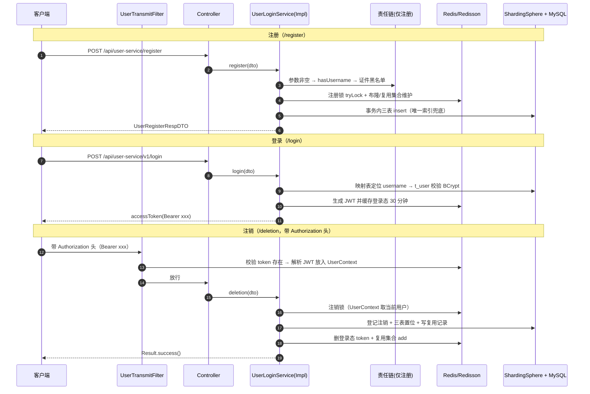

# 用户服务代码阅读指导（v2-sharding 全量版）

> 适用读者：已经读过 docs 下功能分析与设计文档、了解注册/登录/注销三大主流程，但对 JWT、TTL 上下文、布隆过滤器、分布式锁、责任链、分库分表、AES 加密等进阶技术细节还不熟悉的初级程序员。
>
> 讲解对象：`my12306` 项目 **v2-sharding 分支**（提交 `a444b9a`）中 `user-services` 模块的真实代码。
>
> 本指导只讲"代码怎么读"，不重复功能分析。读完本篇，你应当能独立跟着一次 HTTP 请求从 Controller 走到数据库，并说清每一层为什么存在。

---

## 0. 如何使用本文档

### 0.1 建议的前置阅读（按顺序）

本文档假设你已经知道"为什么要做这些功能"。如果你还没有读过，请先按下面的顺序补齐，它们都在 `D:\Java-learning\12306Project\docs\` 下：

1. 《注册登录注销业务流程图与数据库设计.md》——v1 的完整流程图与 5 张表设计，建立最基础的心智模型；
2. 《登录注册功能设计与用户表设计.md》——注册/登录/注销的业务难点与"为什么这样设计用户表"；
3. 《注册功能分析与设计.md》《登录功能分析与设计.md》《注销功能分析与设计.md》——三个功能各自的功能分析/数据设计/业务流程；
4. 《v1到v2升级功能分析与设计.md》——v2 加了哪些东西（分库分表、布隆、锁、责任链、UserContext、加密）以及为什么。

读完上面 4 步，你的脑子里应该有一幅"设计图"；本文档负责把"设计图"对应到"代码地图"。

### 0.2 每章的固定格式

从第 3 章开始，每章都按下面四个小标题组织，方便你对照阅读：

- **目标**：这一站读完后你应该能回答什么问题；
- **读哪些文件（按顺序）**：建议的代码阅读路径，路径都相对于 `services/user-services` 模块；
- **关键代码指引**：该看哪些方法、哪些行、重点是什么；
- **进阶概念解释 / 验证任务**：把这一站涉及的进阶技术用白话讲清楚，或给你一个动手验证的小任务。

### 0.3 阅读工具建议

- 用 IntelliJ IDEA 打开 `my12306` 根目录（它是 Maven 多模块项目，user-services 是其中一个模块），确认 pom 已被识别；
- 读调用链时多用 IDE 的 **Ctrl+左键**（Go to Declaration）和 **Ctrl+Alt+B**（Go to Implementation），少用全文搜索；
- 遇到"谁在调我"的问题，用 **Ctrl+Alt+F7**（Find Usages）反查调用方；
- 想看清请求怎么走，可以在 `UserLoginServiceImpl` 的方法上打断点，用 Debug 模式启动后发请求逐步看；
- 每读完一章，先做该章的"验证任务"再进入下一章。

---

## 1. 阅读前准备

### 1.1 切到正确的分支

本指导讲解的是 v2-sharding 分支（含批次 1-5 的全部实现：注册/登录/注销 + 防穿透/锁/责任链/用户上下文 + 分库分表与 AES 加密）。在仓库根目录执行：

```bash
git checkout v2-sharding
git log -1 --oneline   # 期望看到 a444b9a feat(user-service): v2 批次4-5 分库分表与AES加密
```

> 小技巧：想理解"演进过程"，可以之后用 `git diff master..v2-sharding` 看批次 4-5 到底改了什么；`git log --oneline` 看每个功能提交的先后顺序。

### 1.2 本地运行前提（读代码前先确认环境）

模块通过 ShardingSphere JDBC 驱动连接 MySQL，登录态依赖 Redis。启动或跑测试前请确认：

| 依赖 | 要求 | 配置位置 |
| --- | --- | --- |
| MySQL | 本机 3306，存在 `12306_user_0` 与 `12306_user_1` 两个库 | `src/main/resources/shardingsphere-config.yaml` |
| 分片表 | 每个库有 `t_user_0..31`、`t_user_phone_0..31`、`t_user_mail_0..31`；`12306_user_0` 额外有单表 `t_user_reuse`、`t_user_deletion` | 同上（actualDataNodes 声明了物理表名） |
| Redis | `spring.data.redis` 指向的地址可连接 | `src/main/resources/application.yml` |

> 注意：分片物理表名**必须是 `t_user_0` 这种带前缀的命名**，与 `actualDataNodes` 表达式 `ds_${0..1}.t_user_${0..31}` 一一对应；表名对不上，运行时会报 `Table or view 't_user' does not exist`（逻辑表在分片规则里找不到物理节点）。

### 1.3 想观察 SQL 改写时，打开 sql-show

`shardingsphere-config.yaml` 底部有：

```yaml
props:
  sql-show: false
```

学习阶段建议临时改成 `true`。这样控制台会打印"原始 SQL → 路由到哪个库哪张表 → 加密/解密改写后的 SQL"，是理解分片与加密最直观的窗口（第 9 章会教你怎么读）。改完记得改回来。

### 1.4 模块里先认路

`user-services` 模块的主包是 `edu.swu.fcj.my12306.biz.userservice`，下面的包职责先记个印象，第 2 章会给完整地图：

```text
controller   HTTP 入口，只做参数接收与结果包装
service      业务接口与实现（核心逻辑都在这）
dao          数据层：entity 实体 / mapper 接口 / resources/mapper 下的 XML
dto          req（请求体）与 resp（响应体）
common       通用件：Result、异常、JWT、UserContext、责任链、常量、工具
config       配置：密码编码器、公共字段填充、布隆过滤器、分片算法
```

---

## 2. 总览地图：先建立全局心智模型

### 2.1 文件地图

下面的表格把每个文件归到"它在一张请求图中扮演什么角色"。读的时候先看表，再按第 5-8 章顺序逐个进入。

| 角色 | 文件（相对 `services/user-services/src/main/java/edu/swu/fcj/my12306/biz/userservice/`） |
| --- | --- |
| 启动入口 | `UserServicesApplication.java`（@SpringBootApplication + @MapperScan） |
| HTTP 入口 | `controller/UserInfoController.java`（注册/查用户名/注销）、`controller/UserLoginController.java`（登录/查登录态/登出） |
| 业务接口/实现 | `service/UserLoginService.java`、`service/impl/UserLoginServiceImpl.java`（**全模块最核心的一个类**） |
| 注册责任链 | `common/chain/AbstractChainContext.java`、`common/chain/AbstractChainHandler.java`、`service/handler/filter/user/UserRegisterCreateChainFilter.java` 与 3 个 Handler |
| DTO | `dto/req/`（注册/登录/注销请求）、`dto/resp/`（注册/登录/查询响应） |
| 实体 | `dao/entity/BaseDO.java` + 5 张表的实体 |
| Mapper | `dao/mapper/` 5 个接口；注销置位 SQL 在 `resources/mapper/` 下 3 个 XML |
| 统一响应/异常 | `common/Result.java`、`common/Results.java`、`common/ServiceException.java`、`common/GlobalExceptionHandler.java` |
| 登录态 | `common/JwtUtil.java`、`common/UserInfoDTO.java`、`common/UserContext.java`、`common/UserTransmitFilter.java`、`common/constant/RedisKeyConstant.java` |
| 防穿透/复用 | `config/RBloomFilterConfiguration.java`、`common/toolkit/UserReuseUtil.java`、`common/constant/Index12306Constant.java` |
| 基础设施配置 | `config/PasswordConfig.java`、`config/MyMetaObjectHandler.java`、`config/sharding/CustomDbHashModShardingAlgorithm.java` |
| 资源配置 | `resources/application.yml`、`resources/shardingsphere-config.yaml` |

### 2.2 三条主链路的调用路径总览

下面的时序图先建立"请求怎么流动"的整体感觉；看不懂的组件没关系，第 4-8 章会逐个拆开。



### 2.3 先记住三句"心法"

1. **Controller 很薄，Service 很厚**：Controller 只做 `@Valid` 校验 + 调 Service + 包 Result；判断逻辑、缓存、事务、并发控制全在 Service。
2. **表是"主表 + 映射表 + 辅助表"结构**：`t_user` 存完整信息（按 username 分片）；`t_user_phone`/`t_user_mail` 只做"登录输入 → username"的映射（分别按 phone/mail 分片）；`t_user_reuse`/`t_user_deletion` 是支撑注册/注销规则的单表。
3. **Redis 是"读路径"，MySQL 是"事实源"**：用户名可用性、登录态等高频判断走 Redis；数据库唯一索引和落库记录是最终兜底。

---

## 3. 第一站：入口与配置速览

### 3.1 目标

搞清三件事：应用从哪个类启动、数据源被"换成了谁"、pom 里每个依赖是干嘛的。这一站不要求读懂分片细节（第 8 章专门讲），只要求建立"配置地图"。

### 3.2 读哪些文件（按顺序）

1. `src/main/java/edu/swu/fcj/my12306/biz/userservice/UserServicesApplication.java`
2. `src/main/resources/application.yml`
3. `src/main/resources/shardingsphere-config.yaml`（先通读一遍，不求甚解）
4. `pom.xml`（user-services 模块的依赖清单）

### 3.3 关键代码指引

**启动类**只有两个注解，却决定了两件大事：

```java
@SpringBootApplication          // 组件扫描 + 自动配置
@MapperScan("...dao.mapper")    // 让 MyBatis-Plus 找到所有 Mapper 接口并生成代理
public class UserServicesApplication { ... }
```

**application.yml** 中值得逐行读的部分：

- `server.port: 9001`：本地联调时所有接口都打在这个端口；
- `spring.datasource.driver-class-name` 是 `org.apache.shardingsphere.driver.ShardingSphereDriver`，`url` 是 `jdbc:shardingsphere:classpath:shardingsphere-config.yaml`——意思是：**应用不再直连 MySQL，而是连一个"分片代理数据源"**，真正的两个 MySQL 连接池定义在 yaml 文件里；
- `spring.data.redis`：登录态/锁/布隆过滤器都用它；
- `mybatis-plus.global-config.db-config` 里的三个配置：`logic-delete-field: delFlag`、`logic-delete-value: 1`、`logic-not-delete-value: 0`——这告诉 MyBatis-Plus 把 `delFlag` 当作逻辑删除字段，自动生成的 SQL 会追加 `del_flag = 0` 条件（第 4.2 节详讲）。

**shardingsphere-config.yaml** 先认三个大块，细节第 8 章展开：

- `dataSources`：`ds_0` → `12306_user_0`、`ds_1` → `12306_user_1` 两个物理库；
- `rules`：
  - `!SHARDING`：三张逻辑表 `t_user`（按 username）、`t_user_phone`（按 phone）、`t_user_mail`（按 mail）各自 2 库 × 32 表；
  - `!SINGLE`：`t_user_reuse`、`t_user_deletion` 是"不分片单表"，只挂在 `ds_0`；
  - `!ENCRYPT`：`t_user` 的 `id_card/phone/mail/address` 用 AES 加密落库（应用读写时透明加解密）；
- `props.sql-show`：控制是否打印改写后的 SQL。

**pom.xml** 的依赖与角色对照：

| 依赖 | 在项目里负责什么 |
| --- | --- |
| `spring-boot-starter-web` | HTTP 层（Controller/过滤器/内嵌 Tomcat） |
| `spring-boot-starter-validation` | `@Valid` + `@NotBlank/@Pattern/@Email` 参数校验 |
| `mybatis-plus-spring-boot3-starter` | ORM：实体、Mapper、逻辑删除、公共字段填充 |
| `mysql-connector-j` | MySQL 驱动（被 ShardingSphere 内部数据源使用） |
| `shardingsphere-jdbc` 5.5.2 | 分库分表 + 数据加密（注意：5.5 起坐标从 `shardingsphere-jdbc-core` 改名为 `shardingsphere-jdbc`） |
| `spring-security-crypto` | BCrypt 密码哈希（只用了 `BCryptPasswordEncoder`，没引入整个安全框架） |
| `spring-boot-starter-data-redis` | StringRedisTemplate：登录态、复用集合 |
| `redisson-spring-boot-starter` | RedissonClient：分布式锁 RLock、布隆过滤器 RBloomFilter |
| `transmittable-thread-local` | UserContext 的线程变量（跨线程池传递用户信息，第 4.4 节） |
| `jjwt-api/impl/jackson` | JWT 生成与解析 |

### 3.4 验证任务

- 在 IDE 里分别点开 `ShardingSphereDriver`、`StringRedisTemplate`、`BCryptPasswordEncoder` 的定义，确认它们的来源包与 pom 依赖对得上；
- 打开 yaml 的 `sql-show`，为第 9 章的观察实验做准备（看完记得还原）。

---

## 4. 第二站：通用件——每条调用链都会路过的零件

三条主链路都会用到一批"公共零件"。建议先集中读懂它们，后面读注册/登录/注销时会顺畅很多。顺序：统一响应 → 公共字段 → JWT → 用户上下文 → Redis Key 与复用工具。

### 4.1 统一响应与异常出口

**读哪些文件**：`common/Result.java`、`common/Results.java`、`common/ServiceException.java`、`common/GlobalExceptionHandler.java`

**关键代码指引**：

- `Result<T>` 是前后端约定的统一响应壳：`code`（成功 `"0"`）+ `message` + `data`；用 Lombok `@Accessors(chain = true)` 支持链式 set；
- `Results.success()` / `success(data)` 是唯一"造成功响应"的入口；
- `ServiceException` 是业务异常，抛出的 message 会原样回到前端（如"用户名已存在"）；
- `GlobalExceptionHandler`（@RestControllerAdvice）把异常翻译成统一 Result：
  - `ServiceException` → code `"500"` + 业务文案；
  - 参数校验失败（`MethodArgumentNotValidException`）→ code `"400"` + **第一个**字段的错误 message（对应 DTO 注解里的 message）；
  - JSON 解析失败（`HttpMessageNotReadableException`）→ code `"400"` + "请求体格式错误"；
  - 其他异常 → code `"500"` + "系统异常"（**不把堆栈细节泄露给前端**）。

**为什么这样设计**：前端只需要处理一种响应结构；后端新增接口时不用关心错误怎么包装；安全上避免把异常堆栈直接返回。

### 4.2 公共字段自动填充与逻辑删除（新手高频坑）

**读哪些文件**：`dao/entity/BaseDO.java`、`config/MyMetaObjectHandler.java`

**关键代码指引**：

```java
// BaseDO：每个实体都继承它
@TableField(fill = FieldFill.INSERT)        // 声明：insert 时要填充
private Date createTime;
@TableField(fill = FieldFill.INSERT_UPDATE) // 声明：insert/update 都要填充
private Date updateTime;
@TableField(fill = FieldFill.INSERT)
private Integer delFlag;
```

注解里的 `fill` **只是"声明"**，真正赋值的是 `MyMetaObjectHandler`（实现 MyBatis-Plus 的 `MetaObjectHandler`）：

- `insertFill`（第 18 行起）：insert 时填 `createTime`、`updateTime`、**`delFlag = 0`**；
- `updateFill`（第 28 行起）：update 时刷新 `updateTime`。

**为什么 delFlag 必须由 Handler 填 0**：MyBatis-Plus 开启逻辑删除后，自动生成的查询都会追加 `del_flag = 0`。如果插入时 delFlag 是 NULL，这条新数据在查询时匹配不上 `del_flag = 0`，出现"刚注册完自己查不到自己"的诡异 bug。这正是本模块踩过并修复的坑。

**逻辑删除的完整语义**（对照 application.yml 的 `logic-delete-value: 1`）：

- 调用 MyBatis-Plus 的 `delete(...)` 不会真删，而是转成 `UPDATE ... SET del_flag = 1 WHERE del_flag = 0 AND ...`；
- `selectXxx` 自动追加 `AND del_flag = 0`；
- **注意**：XML 里手写的 SQL 不会被自动增强，所以要自己写 `and del_flag = '0'`（去看 `resources/mapper/UserMapper.xml` 的 `deletionUser`，就是这么做的）。

### 4.3 JWT：无状态凭证，但本项目是"半无状态"

**读哪些文件**：`common/JwtUtil.java`、`common/UserInfoDTO.java`

**关键代码指引**：

- `JwtUtil` 是静态工具类：`generateAccessToken`（第 31 行）生成、`parseJwtToken`（第 46 行）解析；
- 关键常量：
  - `TOKEN_PREFIX = "Bearer "`：返回给前端的 token 自带前缀；
  - `EXPIRATION = 86400L`（24 小时）：**JWT 自身的过期时间**；
  - `ISS = "my12306"`、HS512 密钥（>64 字节）：签名防篡改；
- 载荷（claims）只放 `userId / username / realName` 三个非敏感字段，不放密码；
- `parseJwtToken` 解析时会自动校验签名与过期时间，失败返回 null。

**白话理解 JWT**：token 是"盖了章的三段字符串"（`头.载荷.签名`），服务端用同一个密钥就能验章、读内容，不需要查数据库。所以它是"无状态"的。

**为什么说本项目是"半无状态"**：服务端在签发 JWT 的同时，把 `accessToken` 作为 key 写进 Redis（30 分钟，见第 6 章）。于是：

- JWT 负责"证明你是谁、有没有过期"（自校验，快）；
- Redis 负责"能不能吊销"（登出/注销时删 key，token 立即失效）；
- 两把尺子都通过才放行——`UserTransmitFilter` 的代码注释写得很清楚："登录态事实源在 Redis"。

### 4.4 用户上下文：TTL ThreadLocal

**读哪些文件**：`common/UserContext.java`、`common/UserInfoDTO.java`、`common/UserTransmitFilter.java`

**关键代码指引**：

- `UserContext` 内部是一个 `TransmittableThreadLocal<UserInfoDTO>`（来自 transmittable-thread-local 库），提供 `setUser / getUserId / getUsername / getRealName / getToken / removeUser` 静态方法；
- `UserTransmitFilter implements Filter`，且是 `@Component`——Spring Boot 会把 Filter 类型的 Bean **自动注册到所有请求**（不用写 FilterRegistrationBean）：

```java
public void doFilter(...) {
    // 1. 取 Authorization 请求头
    String authorization = httpServletRequest.getHeader("Authorization");
    // 2. Redis 里有这个 key（登录态还在）才继续
    String cached = stringRedisTemplate.opsForValue().get(authorization);
    if (StringUtils.hasText(cached)) {
        UserInfoDTO userInfo = JwtUtil.parseJwtToken(authorization);
        if (userInfo != null) {
            userInfo.setToken(authorization);   // 带上原始 token，供注销时删 Redis key
            UserContext.setUser(userInfo);
        }
    }
    try {
        filterChain.doFilter(servletRequest, servletResponse);
    } finally {
        UserContext.removeUser();   // 请求结束必须清理！
    }
}
```

**三个为什么**：

1. **为什么用 ThreadLocal**：业务代码（如注销）需要知道"当前登录用户是谁"，但又不想在每个接口参数里传 token；ThreadLocal 让同一线程内的任何代码都能拿到，像"线程私有的全局变量"。
2. **为什么用 TransmittableThreadLocal（TTL）而不是普通 ThreadLocal**：Java 线程池会复用线程，普通 ThreadLocal 在线程池里传递会串号或丢失；TTL 可以在提交任务时把父线程的值"拷贝"给子线程，之后异步场景也能拿到用户信息。
3. **为什么 finally 里必须 remove**：容器线程会被复用，不清除的话，下一次请求可能读到上一个用户的信息（串号事故）。这与"借书要还"是一个道理。

**对比**：v2 之前（master 早期提交）注销接口是"前端把 accessToken 作为参数传进来"；v2 改成"从请求头 → 过滤器 → UserContext"，更贴近真实项目风格，也把"谁在调我"的判断收敛到一处。

### 4.5 Redis Key 设计与会话/锁/复用集合

**读哪些文件**：`common/constant/RedisKeyConstant.java`、`common/constant/Index12306Constant.java`、`common/toolkit/UserReuseUtil.java`

**关键代码指引**：三类 key 都加了 `my12306-user-service:` 前缀避免与别的应用冲突：

| 用途 | Key 格式 | 类型/生命周期 |
| --- | --- | --- |
| 登录态 | `accessToken` 本身（含 `Bearer ` 前缀）作为 key | String，30 分钟 |
| 注册锁 | `lock:user-register:{username}` | 分布式锁，临界区释放 |
| 注销锁 | `user-deletion:{username}` | 分布式锁 |
| 复用集合 | `user-reuse:{hash(username) % 1024}` | Redis Set，成员=已注销可复用的用户名 |

`Index12306Constant.USER_REGISTER_REUSE_SHARDING_COUNT = 1024`：已注销用户名集合拆成 1024 个 Set，避免单个 Redis key 无限膨胀（"大 Key"问题）。

`UserReuseUtil.hashShardingIdx(username)` 计算某个用户名落在哪个分片集合，实现类里与注册/注销处的调用保持一致，保证"写集合"和"读集合"永远命中同一个 key。

### 4.6 验证任务

- 把 `UserTransmitFilter` 的 doFilter 用 Debug 走一遍，观察"带 Authorization 头"与"不带"两种请求下 UserContext 的值；
- 在 `UserContext.removeUser()` 打断点，确认它在每个请求结束时都被执行；
- 用 `redis-cli` 登录后执行 `KEYS my12306-user-service:*`，对照上表理解三类 key 的真实形态。

---

## 5. 主线一：注册——从 Controller 到三张表

### 5.1 目标

能完整讲出一次注册请求经过的 10 个步骤，并解释每一步"防的是什么问题"。

### 5.2 读哪些文件（按顺序）

1. `controller/UserInfoController.java`（只看 `register` 方法）
2. `service/UserLoginService.java`（接口，先看方法注释）
3. `service/impl/UserLoginServiceImpl.java`（**重点**：第 96-178 行 register）
4. `service/handler/filter/user/UserRegisterCreateChainFilter.java` + 3 个 Handler
5. `common/chain/AbstractChainContext.java`、`common/chain/AbstractChainHandler.java`
6. `config/RBloomFilterConfiguration.java`
7. `dto/req/UserRegisterReqDTO.java`

### 5.3 关键代码指引：一次注册的 10 步

对照 `UserLoginServiceImpl.register`（第 98 行起）逐段读：

**第 0 步（Controller/DTO）**：`UserInfoController.register` 只做两件事——`@RequestBody @Valid` 触发 Bean Validation（非空/格式），通过后调 Service 并包 `Results.success(...)`。DTO 上的注解决定了"空数据/格式错误"会被拦在哪一层：

```java
@NotBlank(message = "用户名不能为空")
@Pattern(regexp = "^[^@]+$", message = "用户名不能包含 @")   // 与登录"含@当邮箱"的识别规则配套
private String username;
@Pattern(regexp = "^1[3-9]\\d{9}$", message = "手机号格式不正确")
private String phone;
@Email(message = "邮箱格式不正确")
private String mail;
```

> 阅读提示：`username` 禁 `@` 不是拍脑袋——登录接口按"字符串含 `@` 就是邮箱"来识别身份（第 6 章），如果用户名允许 `@`，识别就会产生歧义。读代码时要习惯找这种"跨功能的因果链"。

**第 1 步（责任链）**：`abstractChainContext.handler(USER_REGISTER_FILTER.name(), requestParam)`。责任链的三个节点按 `order()` 升序执行，任一节点抛异常即中断：

| order | Handler | 校验内容 | 失败文案 |
| --- | --- | --- | --- |
| 0 | `UserRegisterParamNotNullChainHandler` | 7 个字段非空 | "用户名不能为空"等 |
| 1 | `UserRegisterHasUsernameChainHandler` | 用户名可用性（布隆+复用集合） | "用户名已存在" |
| 2 | `UserRegisterCheckDeletionChainHandler` | 证件号注销次数 < 5 | "证件号多次注销账号已被加入黑名单" |

`AbstractChainContext` 的实现值得细读：

- 它实现 `ApplicationContextAware` + `CommandLineRunner`，**启动后**从 Spring 容器取出所有 `AbstractChainHandler` Bean，按 `mark()` 分组、按 `order()` 排序存进 `container`；
- 执行时 `handler(mark, param)` 按组顺序调用；
- 代码注释点明了为什么不用构造注入收集 Handler："避免 Handler 反向依赖 Service 造成的构造循环"（`UserRegisterHasUsernameChainHandler` 注入了 `UserLoginService`，而 Service 又依赖 `AbstractChainContext`）。

**第 2 步（phone/mail 预检）**：分别 `selectCount` 查映射表，命中即抛"手机号已注册"/"邮箱已注册"。这是"提前给友好提示"，真正并发下的最终防线是数据库唯一索引（第 5.4 节）。

**第 3 步（分布式锁）**：

```java
RLock lock = redissonClient.getLock(RedisKeyConstant.LOCK_USER_REGISTER + requestParam.getUsername());
boolean tryLock = lock.tryLock();
if (!tryLock) {
    throw new ServiceException("用户名已存在");
}
try {
    // ... 4-9 步都在锁内
} finally {
    lock.unlock();
}
```

锁的粒度是"单个 username"。两个相同用户名的并发注册只有一个能拿到锁，另一个 tryLock 失败直接按"用户名已存在"处理（此时还没落库，所以返回的是提示而不是数据库冲突）。

**第 4 步**：`passwordEncoder.encode(...)` 把明文密码 BCrypt 哈希（密文固定 60 位，对应表字段 `varchar(60)`）。

**第 5-7 步（三表插入）**：

- `t_user`：主表，存 username + 密码哈希 + 实名信息（注意第 133 行 `userDO.setVerifyStatus(requestParam.getVerifyState())`——DTO 字段叫 verifyState、实体字段叫 verifyStatus，**手动字段映射**是常见出错点）；
- `t_user_phone`：手机号映射表（username, phone）；
- `t_user_mail`：邮箱映射表（防御性判断 mail 非空才插）。

每张表插入都 try-catch `DuplicateKeyException` 并转成对应业务文案——这就是**唯一索引兜底**（第 5.4 节）。

**第 8-9 步（占用用户名，反向维护两条记录）**：

```java
// 8. 删"已注销可复用"记录（DB 逻辑删除 + Redis 集合 remove）
userReuseMapper.delete(...eq username);
stringRedisTemplate.opsForSet().remove(REUSE_SHARDING + hashShardingIdx(username), username);
// 9. 布隆过滤器标记"注册过"
userRegisterCachePenetrationBloomFilter.add(username);
```

含义：注册成功 = 用户名被占用 = 它不再属于"可复用集合"，同时把它写进布隆过滤器（表示"这个用户名一定存在过"）。注意这些"反向维护"都在锁内做，避免并发下读到中间状态。

**第 10 步**：组装 `UserRegisterRespDTO`（只回 username/realName/phone，不回密码）。

### 5.4 进阶概念解释

**（1）布隆过滤器为什么能"防穿透"**

注册页的"用户名可用性查询"是一个超高频率且大部分是"查不存在"的请求（攻击者可以批量试不存在的用户名）。如果每次都查数据库，等于让数据库扛无效流量，这叫**缓存穿透**。

布隆过滤器是一个"位数组 + 多个哈希函数"的结构：插入 username 时把若干个位涂成 1；判断时只要有一个位是 0，就能**确定**该用户名没被插入过（`一定不存在`）。它不存原始数据，所以省内存；代价是**可能有误判**——把没插入过的判断成"存在过"。

本项目配置（`RBloomFilterConfiguration` 第 20 行）：

```java
RBloomFilter<String> f = redissonClient.getBloomFilter("user_register_cache_penetration_bloom_filter");
f.tryInit(64L, 0.03D);   // 预期容量 64、误判率 0.03（学习用的简化值，生产按用户量调）
```

注意 `tryInit` 只在第一次创建时生效；容量定小后不能随意改小，否则已插入的数据可能失效。

**（2）"布隆 + 复用集合"的完整判定表**

布隆过滤器**不能删除**（注销后用户名要能被复用，但布隆里那个用户名还在），所以单独用布隆不够。项目用 `hasUsername`（第 82 行）组合两层：

| 布隆 contains | 复用集合 SISMEMBER | 结论（hasUsername 返回值） |
| --- | --- | --- |
| false（没注册过） | 不查 | true = 可用（布隆"一定不存在"是可信的） |
| true（可能注册过） | true（已注销） | true = 可用（用户名被释放） |
| true（可能注册过） | false（在用/或误判） | false = 不可用 |

布隆误判的后果只是"把一个本可用的用户名误判为不可用"，属于可接受的业务损失，且数据库唯一索引仍保证最终正确。

**（3）为什么注册成功要 `bloom.add` + `集合 remove`，注销要反过来**

- 注册成功 → 用户名被占用：布隆里要有它（否则下次 hasUsername 会误判为"没注册过"）；复用集合里不能有它（它不在"可复用"名单）；
- 注销完成 → 用户名被释放：复用集合里要有它（hasUsername 布隆命中后查集合，能给出"可用"）；DB 的 `t_user_reuse` 落库作为可靠数据源，防止 Redis 数据丢失后无法恢复判断。

**（4）三层防线到底各防什么**

1. 责任链/预检 + Redis 判断：**拦截绝大多数**重复注册，返回友好提示；
2. Redisson 分布式锁：**串行化同一用户名的并发注册**；
3. 数据库唯一索引 `(username, deletion_time)`：**最终兜底**，连分布式锁都拦不住的极端情况（如多实例时钟漂移、Redis 抖动）由数据库保证不可能插入两条同名活数据。

### 5.5 验证任务

- 在 `register` 方法每一行打断点，用 Debug 单步走完一次注册，对照上文 10 步；
- 连续注册两个相同 username，观察第二次是在哪一步被拦下的、返回什么文案；
- 故意用重复 phone 注册，观察"预检拦截"与"唯一索引兜底"两条路径各自何时触发。

---

## 6. 主线二：登录——身份识别与登录态

### 6.1 目标

说清三件事：登录输入怎么被识别成 username、密码怎么校验、token 为什么"签发进 JWT 又写进 Redis"。

### 6.2 读哪些文件（按顺序）

1. `controller/UserLoginController.java`（`login`、`checkLogin`、`logout` 三个接口）
2. `service/impl/UserLoginServiceImpl.java`（第 183-270 行）
3. `dto/req/UserLoginReqDTO.java`、`dto/resp/UserLoginRespDTO.java`
4. `common/JwtUtil.java`（回看 4.3 节）

### 6.3 关键代码指引：login 的五步

**第 1 步：识别输入类型**（第 185-193 行）：遍历字符串，含 `@` 就按邮箱处理，否则按"手机号或用户名"处理。这就是第 5 章说的"用户名禁 @"的配套约定。

**第 2 步：定位 username**：

- 邮箱 → 查 `t_user_mail`（`del_flag = 0`，注销用户的邮箱查不到）拿到 username；
- 非邮箱 → 先查 `t_user_phone`；查不到就把输入原值**降级当 username**（所以用户名登录不需要额外判断）。

这就是"读请求扩散"的解法：手机号/邮箱登录只查**一张映射表的一行**，而映射表按 phone/mail 分片，一次查询只落到一个分片，不会全表扫。

**第 3 步：查主表 + 校验密码**（第 212-218 行）：

```java
UserDO userDO = baseMapper.selectOne(...eq username, eq delFlag 0);
if (userDO == null || !passwordEncoder.matches(password, userDO.getPassword())) {
    throw new ServiceException("账号不存在或密码错误");
}
```

两个细节值得学：

- BCrypt 校验用 `matches(明文, 密文)`，**绝不能用"解密"**——BCrypt 是单向哈希；
- "账号不存在"和"密码错误"用**同一句文案**，防止攻击者通过文案差异枚举账号。

**第 4 步：签发 JWT**（第 220-225 行）：组装 `UserInfoDTO`（userId/username/realName）→ `JwtUtil.generateAccessToken` 得到带 `Bearer ` 前缀的 token。

**第 5 步：登录态写 Redis**（第 233-239 行）：

```java
stringRedisTemplate.opsForValue().set(
        accessToken,                       // key 就是完整 token（含 Bearer 前缀）
        OBJECT_MAPPER.writeValueAsString(loginResp),  // value 是登录信息 JSON
        LOGIN_TOKEN_EXPIRE_MINUTES, TimeUnit.MINUTES); // 30 分钟
```

注意 key 是"含 Bearer 前缀的完整 token"——这与 `UserTransmitFilter` 里直接用请求头 `Authorization` 的值做 `get` 是对得上的。若两端处理不一致，就会出现"登录成功但过滤器总说没登录"。

### 6.4 checkLogin 与 logout：登录态的读与删

同文件继续读：

- `checkLogin`（第 247 行）：按 accessToken 查 Redis，有值就反序列化返回登录信息，没有返回 null——**纯 Redis 读**，不解析 JWT、不查库；
- `logout`（第 266 行）：`stringRedisTemplate.delete(accessToken)`——删掉 key，登录态立即失效。

对照理解"两段式登录态"：

| 层 | 载体 | 职责 | 过期 |
| --- | --- | --- | --- |
| JWT | token 本身 | 证明身份、防篡改、防伪造 | 24 小时（签发时就写死） |
| Redis | key=token | 可吊销、可查询在线状态 | 30 分钟（续期需重新登录） |

所以一个"已登出"的 token：JWT 还没过期、但 Redis 里已删，过滤器查不到 → 视为未登录。

### 6.5 验证任务

- 分别用"手机号、邮箱、用户名"三种输入登录同一账号，确认都能成功且返回同一个 userId；
- 用一个不存在的账号登录，确认返回"账号不存在或密码错误"而不是"账号不存在"；
- 登录后在 Redis 里找到登录态 key，执行 logout 后再调 check-login，确认返回 `data: null`。

---

## 7. 主线三：注销与登出——用户名释放与状态失效

### 7.1 目标

读懂注销的完整事务：为什么注销要"登记 + 三表置位 + 删 token + 写复用记录"四件事一起做，以及锁为什么要放在 try 外面。

### 7.2 读哪些文件（按顺序）

1. `controller/UserInfoController.java`（`deletion` 方法——注意它不再接收 accessToken 参数）
2. `common/UserTransmitFilter.java` + `common/UserContext.java`（回看 4.4 节）
3. `service/impl/UserLoginServiceImpl.java`（第 276-335 行 deletion）
4. `dao/mapper/UserMapper.java` + `resources/mapper/UserMapper.xml`（同看 phone/mail 两个 XML）

### 7.3 关键代码指引：deletion 的十步

**第 1-2 步：身份来源与本人校验**（第 279-287 行）：

- `UserContext.getUsername()` 取当前登录用户（由过滤器写入）；为空抛"未登录或登录已过期"；
- 请求体里的 username 必须与登录用户一致，否则抛"注销账号与登录账号不一致"——**只能注销自己**。

**第 3 步：分布式锁，放在 try 外面**（第 289-292 行）：

```java
RLock lock = redissonClient.getLock(RedisKeyConstant.USER_DELETION + requestParam.getUsername());
lock.lock();          // 阻塞式拿锁
try {
    // 4-10 步
} finally {
    lock.unlock();
}
```

对比注册用的是 `tryLock()` 失败即返回，注销用的是 `lock()` 阻塞等待。为什么锁要在 try 外：Redisson 要求"谁拿到锁谁释放"，如果把 `lock()` 放进 try，一旦拿锁本身抛异常，finally 会对一个没拿到的锁执行 unlock，可能误删别的请求的锁。**这是分布式锁的经典陷阱**，代码注释也点明了。

**第 4 步：查主表拿实名信息**（第 294-299 行）：注销登记表需要证件号、映射表置位需要 phone/mail，所以先查一次 `t_user`（`del_flag = 0`）。

**第 5 步：登记注销**：insert `t_user_deletion`（idType + idCard）。这条记录是"同一证件多次注销"的计数来源（注册责任链第 3 个 Handler 用 `count >= 5` 判断黑名单）。

**第 6-7 步：三表置位**：主表和两张映射表分别调用 XML 里的 `deletionUser`：

```sql
update t_user
set deletion_time = #{deletionTime},
    del_flag      = '1'
where username = #{username}
  and del_flag = '0'
```

这里同时做两件事：`deletion_time` 置为当前毫秒时间戳（让 `(username, deletion_time)` 唯一索引"让位"，见 7.4）；`del_flag = 1`（逻辑删除，查询不可见）。phone/mail 表以 phone/mail 为 where 条件——它们恰好也是各自的分片键，能单分片路由。

**第 8 步：删 Redis 登录态**：`stringRedisTemplate.delete(token)`，token 来自 `UserContext.getToken()`（即 Authorization 头的完整值）。注销后这个 token 立即失效。

**第 9-10 步：写复用记录**：`t_user_reuse` 落库 insert + Redis 复用集合 `add`——把 username 放回"可复用名单"，供下一次注册的 hasUsername 判断。

整个方法有 `@Transactional(rollbackFor = Exception.class)`：上面任何一步失败，前面所有 DB 写入全部回滚，不会出现"表置位了但复用记录没写"的中间态。

### 7.4 进阶概念解释

**（1）为什么注销不物理删除**

实名信息（证件号等）需要留存用于黑名单登记与审计；同时手机号/邮箱/用户名要能被复用。物理删除会丢失全部痕迹，"置位 + 登记 + 复用记录"是兼顾"不可用"与"可释放"的软删除方案。

**（2）`(username, deletion_time)` 唯一索引是怎么"让位"的**

表结构（可在数据库执行 `SHOW CREATE TABLE 12306_user_0.t_user_0` 查看）：

```sql
deletion_time bigint DEFAULT '0',            -- 活跃用户默认 0
UNIQUE KEY idx_username (username, deletion_time)
```

- 活跃用户：`deletion_time = 0`，唯一索引保证同名只能有一条**活的**；
- 注销：`deletion_time = 当前毫秒`，原行的 `(username, 0)` 不再占用"0 槽位"，新注册同名用户插入 `(username, 0)` 不会冲突 → 用户名被释放；
- 极端重复注销同一位：时间戳精确到毫秒，仍可能重复，所以有分布式锁 + `del_flag=0` 条件保护。

**（3）为什么置位 SQL 的 where 必须带分片键**

`t_user` 按 username 分片：where 里有 username 等值条件，ShardingSphere 才能算出唯一的物理表；如果写成不带分片键的更新（如只按 id），代理只能把 SQL 广播到全部分片表执行。三张表的置位 SQL 都遵守了这个约束（username/phone/mail 分别是各自的分片键）。

### 7.5 验证任务

- 注册 → 登录 → 注销后，分别在数据库查 `t_user`（del_flag、deletion_time）、`t_user_reuse`、`t_user_deletion` 三张表，确认各多了一条什么记录；
- 注销后立即用同 username 调 has-username，确认返回 true（可复用）；
- 用"注销过的手机号/邮箱"再登录，确认失败（映射表 del_flag=1 已查不到）；
- 尝试注销一个与登录账号不同的 username，确认返回"注销账号与登录账号不一致"。

---

## 8. 数据层与分片专题（回看第 3 章配置）

读完三条主线后，你已经见过实体、Mapper、XML 和分片配置，这一章把它们串起来讲透。

### 8.1 目标

能说清：实体与物理表怎么对应、MyBatis-Plus 自动 SQL 为什么能路由、分片算法怎么手算、AES 加密在哪几列生效。

### 8.2 实体与 Mapper：先读这些文件

1. `dao/entity/BaseDO.java` + `UserDO`（t_user 主表）→ `UserPhoneDO`/`UserMailDO`（映射表）→ `UserReuseDO`/`UserDeletionDO`（单表）
2. `dao/mapper/` 下 5 个 Mapper 接口
3. `resources/mapper/` 下 3 个 XML

要点：

- 每个实体用 `@TableName("t_user")` 等声明**逻辑表名**（不带分片后缀）；真正物理表名由 ShardingSphere 按规则补全；
- 实体的 `id` 字段虽然没有 `@TableId` 注解，但 MyBatis-Plus 默认把名为 `id` 的字段当主键；`UserReuseDO` 没有 id 字段，启动时会看到一条 WARN：`Can not find table primary key in Class UserReuseDO`——**这是预期行为**（该实体只用 username 维度操作），不是错误；
- 三个 Mapper 接口各自声明了 `deletionUser(...)`，实现都在 XML 里，是"手写 SQL"的典型示范；
- application.yml 的 `mybatis-plus.mapper-locations: classpath:mapper/*.xml` 告诉框架去哪里找 XML。

### 8.3 MyBatis-Plus 自动 SQL 与分片路由

读 Service 代码时你看到的 `selectOne(Wrappers.lambdaQuery(...).eq(UserDO::getUsername, ...))` 是 MyBatis-Plus 自动生成的 SQL：

```sql
SELECT ... FROM t_user WHERE del_flag = 0 AND (username = ? AND del_flag = ?)
```

这条 SQL 发给 ShardingSphere 后，代理会做三件事：

1. 解析出逻辑表 `t_user` 和分片键 `username` 的等值条件；
2. 用配置的算法算出目标物理表（如 `ds_0.t_user_12`），只路由到那一张；
3. 逻辑删除插件负责把 `del_flag` 条件拼进去。

**关键学习点：分片键等值条件 = 精准路由的前提**。所有 wrapper 查询都带上了各自表的分片键（t_user 用 username、映射表用 phone/mail），这就是"每条 SQL 都能单分片路由"的原因。手工 XML 的 where 也遵守同样约定。

### 8.4 分片算法：`CustomDbHashModShardingAlgorithm` 手算一遍

**读文件**：`config/sharding/CustomDbHashModShardingAlgorithm.java`（53 行，很短）

核心逻辑：

```java
// props：sharding-count=32，table-sharding-count=16（库算法）或 1（表算法）
suffix = Math.abs((long) value.hashCode()) % shardingCount / tableShardingCount;
// 从 availableTargetNames（ds_0/ds_1 或 t_user_0..t_user_31）里挑后缀匹配的那个
```

对照 yaml 里三张表的分片配置理解参数：

| 表 | 库算法 | 表算法 | 分片键 |
| --- | --- | --- | --- |
| t_user | CLASS_BASED `\|hash\|%32/16` | CLASS_BASED `\|hash\|%32/1` | username |
| t_user_phone | CLASS_BASED `\|hash\|%32/16` | CLASS_BASED `\|hash\|%32/1` | phone |
| t_user_mail | CLASS_BASED `\|hash\|%32/16` | CLASS_BASED `\|hash\|%32/1` | mail |

> 配置里的注释解释了一个版本差异：5.5 起"手动分片表"不允许用自动分片算法 HASH_MOD，所以表算法也改走 CLASS_BASED；`table-sharding-count=1` 时 `\|hash\|%32/1 = \|hash\|%32`，与原 HASH_MOD 语义一致。

**手算示例**：假设注册用户名 `zhangsan`（Java `String.hashCode()` = -1432604556）：

```text
表下标 = |hash| % 32 = 1432604556 % 32 = 12   → 物理表 t_user_12
库下标 = 12 / 16 = 0                          → 物理库 ds_0（12306_user_0）
```

所以 `zhangsan` 的行会落在 `12306_user_0.t_user_12`。可以用 sql-show 打开后实际插入一条验证。

另一个公式要区分：`UserReuseUtil.hashShardingIdx` 用的是 `Math.abs(hashCode() % 1024)`（先取余再取绝对值）。对 `zhangsan`：`hashCode % 1024 = -908`，绝对值 908，所以复用集合 key 是 `...user-reuse:908`。**两个工具类的取模顺序不同**（一个先绝对值、一个后绝对值），读代码时别想当然。

### 8.5 单表为什么用 !SINGLE

`t_user_reuse`、`t_user_deletion` 数据量小、没有分片键需求，属于"不分片单表"。它们在 yaml 里通过 `!SINGLE` 规则声明只存在于 `ds_0`：

```yaml
- !SINGLE
  tables:
    - ds_0.t_user_reuse
    - ds_0.t_user_deletion
  defaultDataSource: ds_0
```

这样 MyBatis-Plus 对这两张表的任何 SQL 都固定路由到 `ds_0`，不会误当成分片表去广播。实体与 Mapper 不需要任何分片相关代码——这就是透明路由。

### 8.6 AES 加密：哪些列、为什么映射表不加密

对照 yaml 的 `!ENCRYPT` 规则：

| 表 | 加密列 |
| --- | --- |
| t_user | `id_card`、`phone`、`mail`、`address` |
| t_user_phone / t_user_mail | **不加密** |

**为什么映射表不加密**：`t_user_phone` 按 phone 分片、`t_user_mail` 按 mail 分片。分片路由必须用**明文**去算哈希——如果落库前把 phone 加密，代理就不知道路由到哪张表了。所以映射表必须保留明文并承担唯一性校验。

**为什么 t_user 里的 phone/mail 可以加密**：`t_user` 的分片键是 username，phone/mail 只作为冗余展示字段，从不按它们查询 t_user（登录是"映射表明文定位 username → 按 username 查 t_user"），所以加密不影响路由与查询。

**加密的读写效果**（对应用透明）：

- INSERT 时：应用给的是明文，ShardingSphere 用 AES 加密后写入 `id_card` 等列；
- SELECT 时：从列里读出密文，ShardingSphere 自动解密成明文返回；
- 直接连 MySQL 查物理表，看到的 `id_card/phone/mail/address` 是密文——这是验证加密是否生效的最直观方法。

加密配置要点（5.5.x）：

```yaml
common_encryptor:
  type: AES
  props:
    aes-key-value: my12306AesKey2026
    digest-algorithm-name: SHA-1   # 5.5 起必须显式指定
```

加密列不能建普通索引做等值查询优化（等值查询会先把值加密成密文再比较），本项目对加密列也不做数据库查询，职责划分是清晰的。

### 8.7 主键生成：为什么"自增"不是选项

看注册的 INSERT 日志会发现 id 是一个 19 位大数（如 `2095859864996409346`），而不是 1、2、3——这是 MyBatis-Plus 默认的 `ASSIGN_ID`（雪花算法类）在应用侧生成的主键。

原因：分库分表后，32 张表的数据库自增会各自从 1 开始，必然重复；全局唯一 ID 必须在应用侧生成。实体没写 `@TableId(type = IdType.AUTO)`，所以走了默认的雪花策略。`t_user_reuse` 例外——实体没有 id 字段，插入时不带 id，由数据库自增兜底（它的 id 不参与跨表关联，无所谓重复）。

### 8.8 验证任务

- 注册一个用户后，打开 sql-show 或查 MySQL，确认数据落在预期的物理表（用 8.4 的方法先手算）；
- 直接连数据库查该行，确认 `id_card/phone/mail` 是密文，但 username、del_flag 是明文；
- 在 `t_user_phone_0` 里确认该手机号是明文（映射表不加密）；
- 执行 `SHOW CREATE TABLE 12306_user_0.t_user_0`，找到 `idx_username (username, deletion_time)` 唯一索引。

---

## 9. 用测试与本地验证辅助学习

### 9.1 四个测试类的分工

测试在 `src/test/java/edu/swu/fcj/my12306/biz/userservice/` 下：

| 测试类 | 类型 | 覆盖内容 | 运行条件 |
| --- | --- | --- | --- |
| UserLoginServiceTest | 服务层（Mock Redis/Redisson） | 注册、三种身份登录、密码错误/账号不存在、hasUsername 布隆+集合判定等 6 例 | 直接可跑（连本地分片库） |
| UserDeletionServiceTest | 服务层（Mock Redis/Redisson） | 注销主链路冒烟：登记 + 三表置位 + 写复用记录 | 直接可跑 |
| UserRegisterTest | MockMvc 集成（真实 Redis） | HTTP 层注册：成功、重复用户名/手机号、校验失败、非法 JSON | 需 `-Dredis.it=true` |
| UserLoginTest | MockMvc 集成（真实 Redis） | HTTP 层登录/登出/登录态检查 | 需 `-Dredis.it=true` |

推荐命令（在 `my12306` 根目录）：

```bash
# 1) Mock 冒烟（不依赖真实 Redis，学习期最常用）
mvn -pl services/user-services test -Dtest=UserLoginServiceTest,UserDeletionServiceTest

# 2) 全部测试（含依赖真实 Redis 的 HTTP 集成用例）
mvn -pl services/user-services test -Dredis.it=true
```

`@EnabledIfSystemProperty(named = "redis.it", matches = "true")` 是开关：没有这个系统属性时，后两个类整类跳过。

### 9.2 为什么 Mock 测试能"绕过" Redis

看 `UserLoginServiceTest` 顶部：用 `@MockBean` 替换了 `StringRedisTemplate`、`RedissonClient`、`RBloomFilter`，在 `@BeforeEach` 里：

```java
when(stringRedisTemplate.opsForValue()).thenReturn(mock(ValueOperations.class));
when(stringRedisTemplate.opsForSet()).thenReturn(mock(SetOperations.class));
RLock lock = mock(RLock.class);
when(lock.tryLock()).thenReturn(true);          // 锁永远拿得到
when(redissonClient.getLock(anyString())).thenReturn(lock);
```

布隆过滤器 mock 默认 `contains=false`，所以 hasUsername 直接判"可用"。这样注册/登录/注销的**数据库链路**是真实的，只有 Redis/Redisson 是替身——正好适合学习"业务逻辑"而不被中间件干扰。

### 9.3 测试数据清理：精确条件背后的分片意识

每个测试 `@AfterEach` 都做物理删除清理：

```java
jdbcTemplate.update("DELETE FROM t_user WHERE username = ?", name);
jdbcTemplate.update("DELETE FROM t_user_phone WHERE username = ?", name);
...
```

这里有个值得你留意的细节：

- `t_user` 的 username 就是分片键 → 按 username 删除是**单分片路由**，只碰一张物理表；
- `t_user_phone`/`t_user_mail` 的分片键是 phone/mail，按 username 删除其实会**广播到全部分片表**（代码注释写的是"按分片键删除"，实际只有主表严格成立）。

测试数据量小，广播也能跑完，所以测试能过；但读代码时要有这个"分片键意识"——生产环境的清理/更新若不带分片键，代价是扫全部分片表。

### 9.4 sql-show 输出怎么读

打开 sql-show 后，运行一条注册，控制台会出现多行日志。抓一段典型输出看结构：

```text
==>  Preparing: SELECT COUNT( * ) AS total FROM t_user_phone WHERE del_flag=0 AND (phone = ? AND del_flag = ?)
==> Parameters: 13900000011(String), 0(Integer)
```

MyBatis 打印的是**发给 ShardingSphere 的原始逻辑 SQL**（还带着 MP 自动拼接的 del_flag）。想看"路由到哪张物理表、加密怎么改写"，要打开 ShardingSphere 自己的日志（5.5.2 输出形如 `Actual SQL: ds_0 ::: SELECT ... FROM t_user_12 ...`）。对照 8.4 节的手算结果，你就能验证路由是否正确。

### 9.5 本地 curl 五连验证

先启动应用（IDE 里运行 `UserServicesApplication`，端口 9001），然后按顺序执行。以下命令在 Git Bash / PowerShell（注意转义）下均可：

**① 注册**

```bash
curl -X POST http://localhost:9001/api/user-service/register \
  -H "Content-Type: application/json" \
  -d '{"username":"readerguide01","password":"123456","realName":"阅读练习","idType":1,"idCard":"110101199001011111","phone":"13900009901","mail":"readerguide01@test.com"}'
```

期望：`{"code":"0","message":null,"data":{"username":"readerguide01",...}}`

**② 用户名可用性**

```bash
curl "http://localhost:9001/api/user-service/has-username?username=readerguide01"
curl "http://localhost:9001/api/user-service/has-username?username=brand_new_name"
```

期望：已注册的返回 `false`，没注册过的返回 `true`。

**③ 登录（记录返回的 accessToken）**

```bash
curl -X POST http://localhost:9001/api/user-service/v1/login \
  -H "Content-Type: application/json" \
  -d '{"usernameOrMailOrPhone":"13900009901","password":"123456"}'
```

期望：`data.accessToken` 以 `Bearer eyJ...` 开头。

**④ 登录态检查**

```bash
curl "http://localhost:9001/api/user-service/check-login?accessToken=<上一步的完整accessToken>"
```

期望：返回登录信息。

**⑤ 注销（token 放在 Authorization 请求头，不是参数）**

```bash
curl -X POST http://localhost:9001/api/user-service/deletion \
  -H "Content-Type: application/json" \
  -H "Authorization: <上一步的完整accessToken>" \
  -d '{"username":"readerguide01"}'
```

期望：`code=0`；随后再执行 ④ 应返回 `data: null`（token 已被删）。再去数据库确认 `t_user` 该行 `del_flag=1`、`t_user_reuse` 有记录。

> 进阶验证：把上面用户名换成别的值多注册几个，用 sql-show 观察每次 INSERT 路由到的物理表是否与 8.4 手算一致。

---

## 10. 自测清单与进阶学习要点

下面的问题都来自本模块真实代码。先自己回答，答不出来就按"答案线索"回对应文件/文档找，不要直接搜题解。

### 10.1 请求链路类

1. 一次注册请求从 Controller 到数据库，中间经过哪几层？哪些层负责"校验"、哪些层负责"兜底"？（线索：第 5 章）
2. 为什么 Controller 里 `deletion` 方法没有 accessToken 参数，也能知道当前登录用户是谁？（线索：UserTransmitFilter + UserContext）
3. `@Valid` 校验失败时返回的 code 是多少？由哪个类决定？（线索：GlobalExceptionHandler）

### 10.2 注册/可用性类

4. 布隆过滤器"一定不存在"为什么可信，"可能存在"为什么还要再查复用集合？（线索：UserLoginServiceImpl.hasUsername 第 82 行）
5. 布隆过滤器误判的最坏业务后果是什么？为什么可以接受？（线索：5.4 节判定表）
6. 注册为什么要同时"删 t_user_reuse + Redis 集合 remove + 布隆 add"？漏掉其中任一步会发生什么？（线索：register 第 161-168 行）
7. 为什么 register 用 `tryLock()` 失败即抛"用户名已存在"，而 deletion 用 `lock()` 阻塞等待？（线索：对比 5.3 与 7.3 两处代码）

### 10.3 登录态类

8. JWT 自己能校验签名和过期，为什么还要 Redis 存一份 30 分钟的登录态？（线索：登出/注销如何让 token 失效）
9. Redis 登录态的 key 为什么是"含 Bearer 前缀的完整 token"？（线索：login 第 234 行与 UserTransmitFilter 第 32 行）
10. 登录时"账号不存在"和"密码错误"为什么返回同一句文案？（线索：login 第 215-218 行注释）
11. 用户名为什么不能包含 `@`？（线索：注册 DTO 的 @Pattern 与 login 的身份识别逻辑）

### 10.4 数据层/分片类

12. 为什么注销要写 `deletion_time` 而不是直接物理删除或只置 del_flag？（线索：唯一索引 (username, deletion_time) 的"让位"原理）
13. 为什么置位 SQL（deletionUser）的 where 必须包含分片键？（线索：8.3 节）
14. `t_user` 的 phone/mail 加密了，但 `t_user_phone`/`t_user_mail` 不加密，为什么？（线索：8.6 节）
15. 为什么主键不用数据库自增？（线索：8.7 节；对比 t_user_reuse 的例外）
16. 用 Java 语义手算一个你名字的分片位置（表下标、库下标、复用集合分片），再注册验证。（线索：8.4 节）

### 10.5 常见坑自查

17. 如果新增一张分片表但 yaml 没配 actualDataNodes，运行时会报什么？（线索：第 1.2 节）
18. 如果 MyMetaObjectHandler 不给 delFlag 填 0，注册后会发生什么？（线索：4.2 节）
19. 如果注销/登出删 Redis 时 key 与写入时不一致（如一边带 Bearer 一边不带），现象是什么？（线索：6.3 节末尾）

---

## 附录 A：文件 → 章节速查表

| 想读的内容 | 文件 | 章节 |
| --- | --- | --- |
| 应用启动与注解 | UserServicesApplication.java | 3 |
| 数据源/Redis/逻辑删除配置 | resources/application.yml | 3、4.2 |
| 分库分表+加密配置 | resources/shardingsphere-config.yaml | 3、8 |
| 统一响应与异常 | common/Result、Results、ServiceException、GlobalExceptionHandler | 4.1 |
| 公共字段填充 | dao/entity/BaseDO.java、config/MyMetaObjectHandler.java | 4.2 |
| JWT | common/JwtUtil.java、common/UserInfoDTO.java | 4.3 |
| 用户上下文 | common/UserContext.java、common/UserTransmitFilter.java | 4.4 |
| Redis Key/复用分片 | common/constant/RedisKeyConstant.java、common/toolkit/UserReuseUtil.java | 4.5 |
| 注册链路 | controller/UserInfoController.java → service/impl/UserLoginServiceImpl.java(96-178) → handler 3 个 | 5 |
| 责任链容器 | common/chain/AbstractChainContext.java | 5.3 |
| 布隆配置 | config/RBloomFilterConfiguration.java | 5.4 |
| 登录链路 | controller/UserLoginController.java → UserLoginServiceImpl.java(183-241) | 6 |
| 登出/登录态检查 | UserLoginServiceImpl.java(243-270) | 6.4 |
| 注销链路 | UserLoginServiceImpl.java(276-335) + resources/mapper/*.xml | 7 |
| 实体/Mapper | dao/entity/*、dao/mapper/* | 8.2 |
| 分片算法 | config/sharding/CustomDbHashModShardingAlgorithm.java | 8.4 |
| 测试 | src/test/java/.../UserLoginServiceTest 等 4 个类 | 9 |

## 附录 B：常见报错与排查速查

| 现象 | 最可能原因 | 排查方向 |
| --- | --- | --- |
| `Table or view 't_user' does not exist` | 分片规则与实际物理表名不一致（如少 `t_` 前缀、缺分片表） | 对比 actualDataNodes 与 `SHOW TABLES` |
| `digest-algorithm-name can not be null or empty` | ShardingSphere 5.5 AES 必须配 digest | 给 encryptor 补 `digest-algorithm-name: SHA-1` |
| snakeyaml `NoSuchMethodError` | ShardingSphere 5.3/5.4 与 Spring Boot 3.3 的 snakeyaml 2.2 冲突 | 升级到 `shardingsphere-jdbc` 5.5.x |
| 启动日志 `Can not find table primary key ... UserReuseDO` | 实体无 id 字段，属预期 | 不处理（8.2 节） |
| 注册成功但查不到 | delFlag 未填充为 0 | 检查 MyMetaObjectHandler（4.2 节） |
| 注销/登出后 check-login 仍返回数据 | 删 Redis 的 key 与写入时不一致（Bearer 前缀） | 对照 login 与 UserTransmitFilter 的 key（6.3 节） |
| 手写 SQL 全表广播 | where 缺少分片键等值条件 | 检查 SQL 是否带 username/phone/mail（8.3 节） |
| 代码引用的 `JwtUtil`/`UserInfoDTO` 标红 | 误在 learning 分支或 master 早期版本看代码 | `git checkout v2-sharding`（1.1 节） |

## 附录 C：与原项目及后续学习的关系

- 本模块是学习项目 my12306 的自建实现：责任链、UserContext、布隆等是**轻量版**，原项目（nageoffer/12306）把这类能力做成了独立 frameworks 模块并在各服务复用——代码思路一致，组织方式不同；
- 本指导只覆盖 user-services 已实现功能；购票、订单、支付等未实现模块不在范围内，需要全景时回读《12306学习开发文档.md》；
- 想进阶，建议下一步读原项目 `UserLoginServiceImpl` 与 frameworks 的 `bloom-filter`、`idempotent`、`cache` 组件，对照本模块找"少了哪层、多了哪层"。

> 最后提醒：代码阅读指导的价值在于"你亲手走了一遍调用链"。请至少把 9.5 节的 curl 五连完整跑通一次，再回头重读第 5-7 章——那时你会发现自己已经能预测每一步的输出。
