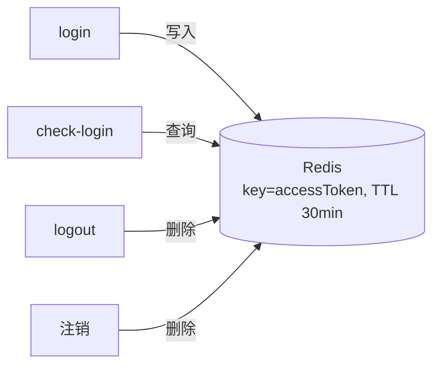

# 登录功能分析与设计（学习文档）

> 本文档以"登录"功能为载体，示范一份功能分析文档的完整写法：**功能分析 → 数据设计 → 业务流程**，并讲清每一步"在分析什么、为什么这样分析"。结构与《注销功能分析与设计.md》同模板。
>
> 定位：**分析与设计稿**。以原项目完整设计为主，同时标注我们 my12306 的现状（登录已实现，用户上下文未做）与 v1/v2 边界。
>
> 事实来源：原项目 `UserLoginServiceImpl.login`、`JWTUtil`、my12306 登录实现、既有文档。

---

## 〇、功能分析的方法论（先学会"怎么想"）

写任何功能分析文档前，先回答这 6 个问题：

| 问题 | 具体要分析什么 | 产出 |
| --- | --- | --- |
| 做什么 | 功能的目标、输入输出、主要动作 | 功能清单 |
| 边界在哪 | 什么算这个功能、什么不算；与相邻功能的划分 | 范围说明 |
| 规则是什么 | 业务约束：必填、唯一、状态、权限 | 业务规则表 |
| 和谁联动 | 依赖的前置功能、影响的下游功能 | 关联功能图 |
| 异常怎么办 | 非法输入、重复操作、并发、未登录 | 异常场景表 |
| 非功能要求 | 并发安全、性能、安全（敏感信息）、审计 | 非功能需求 |

分析顺序建议：**先写功能清单 → 再定业务规则 → 补边界与异常 → 最后画流程**。数据设计在功能分析基本稳定后再做，因为"表结构是为业务规则服务的"。

---

## 一、功能分析（登录）

### 1.1 需求背景与目标

**一句话目标**：用户用"用户名/手机号/邮箱 + 密码"证明身份，系统签发登录凭证（accessToken），后续业务凭凭证识别"当前是谁"。

**为什么登录是一个独立功能**：

- 注册建立了身份数据，登录是"验证身份 → 签发凭证"的入口。
- 购票、订单等业务都需要知道"当前登录用户"，登录态是它们的公共前置。
- 登录是系统被攻击的高发点：暴力破解、账号枚举、凭证盗用，都需要在设计中考虑。

### 1.2 功能清单

| 功能 | 说明 | 涉及数据 |
| --- | --- | --- |
| 身份识别 | 判断输入是用户名/手机号/邮箱（含 @ 即邮箱） | t_user_phone / t_user_mail / t_user |
| 密码校验 | BCrypt matches 校验密文 | t_user.password |
| 签发凭证 | 生成 JWT（userId/username/realName） | Redis |
| 登录态缓存 | accessToken → 登录信息，TTL 30 分钟 | Redis |
| 登录态检查 | check-login：按 token 查 Redis | Redis |
| 登出 | logout：删除 Redis 中的 token | Redis |

### 1.3 业务规则

| 规则 | 说明 |
| --- | --- |
| 必填 | usernameOrMailOrPhone、password 非空 |
| 识别规则 | 输入含 @ 视为邮箱；否则先按手机号查，查不到当用户名 |
| 用户名不含 @ | 与识别规则配套（注册侧约束） |
| 查询带 del_flag=0 | 注销用户（del_flag=1）不可登录 |
| 防枚举 | "账号不存在"与"密码错误"返回同一文案 |
| 两层凭证 | JWT 签名有效期 24h；Redis 登录态 30 分钟，以 Redis 为准 |
| 登出即失效 | logout 删除 Redis token，登录态立即失效 |

### 1.4 关联功能（联动）

```
注册 ──► 提供映射表（手机号/邮箱 → username）与主表密码

注销 ──► 置位 del_flag（登录查不到）+ 删除 token（凭证失效）

check-login ──► 登录态的读接口（刷新页面保持登录）
logout ──► 登录态的终结接口
```

登录是"注册的消费方、注销的依赖方"：没有注册建立的映射和密码无法登录；注销后账号不可登录、token 作废。

### 1.5 边界与异常场景

| 场景 | 处理 |
| --- | --- |
| 密码错误 | "账号不存在或密码错误"（防枚举） |
| 账号不存在（用户名输入） | 同上 |
| 邮箱未注册 | "用户名/手机号/邮箱不存在"（映射表查不到） |
| 注销用户登录 | 主表 del_flag=0 查不到 → "账号不存在或密码错误" |
| 参数缺失 | @Valid 拦截，返回 400 |
| 暴力破解 | v2：登录失败次数限制 / 限流 |
| Redis 不可用 | 登录态无法写入/读取，需监控告警（v1 直接报错） |

---

## 二、数据设计

### 2.1 涉及表总览

| 表 | 职责 | 登录时做什么 | 分片键（v2） |
| --- | --- | --- | --- |
| t_user | 会员主表 | **只读**：按 username 查密文 | username |
| t_user_phone | 手机号映射 | **只读**：phone → username | phone |
| t_user_mail | 邮箱映射 | **只读**：mail → username | mail |
| Redis | 登录态 | 写入/读取/删除 token | - |

### 2.2 逐表设计

#### t_user：会员主表（登录校验核心）

| 字段 | 类型 | 登录中的作用 |
| --- | --- | --- |
| username | varchar(256) | 主表查询条件 |
| password | varchar(60) | **BCrypt 密文**，用 matches 校验 |
| id / real_name | bigint / varchar | 签发 token 的载荷来源 |
| del_flag | tinyint(1) | **必须带 del_flag=0**，注销用户不可登录 |

**索引**：`UNIQUE (username, deletion_time)`（登录按 username 单值查询，索引命中）

#### t_user_phone / t_user_mail：映射表（身份定位）

| 字段 | 作用 |
| --- | --- |
| phone / mail | 登录输入，查询条件 |
| username | 查询结果，用于定位主表 |
| del_flag | 查询条件（del_flag=0） |

**关键认知**：映射表里**没有密码**，密码只存在于主表。登录是"映射表定位 username → 主表校验密码"两步。

### 2.3 核心机制

**1. 映射表解决"读请求扩散"**

用户数据按 username 分片（v2），但登录可能输入手机号/邮箱——此时不知道用户在哪个分片。方案：映射表按 phone/mail 分片，输入手机号直接路由到手机号所在分片查到 username，再按 username 路由主表。**两次查询都收敛到单分片**，不扩散。

**2. 两层凭证各司其职**

| 凭证 | 过期 | 作用 |
| --- | --- | --- |
| JWT | 24h | 签名不可篡改，载荷 userId/username/realName |
| Redis token | 30 分钟 | 登录态事实源：check-login 查它、logout 删它 |

Redis 先失效则登录态结束；JWT 是"凭证本身"的有效期。注销时删除 Redis token，凭证立即作废。

**3. 为什么查询必须带 del_flag=0**

注销用户 del_flag=1，若查询不带条件，已注销账号仍能登录——安全漏洞。所有用户查询（登录、可用性、映射定位）都要带。

**4. 为什么统一错误文案**

区分"账号不存在"和"密码错误"会让攻击者枚举出哪些账号存在。统一返回"账号不存在或密码错误"，牺牲少量体验换安全。

### 2.4 my12306 现状核对

**已就绪（已实现）**：

- `UserLoginReqDTO` 校验注解；`UserLoginService` 接口（login/checkLogin/logout）
- `UserLoginServiceImpl.login`：识别类型 → 映射定位 → 主表校验 → JWT → Redis 30 分钟
- `JwtUtil`（jjwt，HS512，Bearer 前缀）+ `UserInfoDTO`
- `UserLoginController`（login / check-login / logout）
- 测试：UserLoginTest（真实 Redis，-Dredis.it=true）、UserLoginServiceTest（Mock Redis）

**未实现（后续优化）**：

- **用户上下文**：请求带 token → 过滤器解析 → 放入当前用户（注销、订单等接口的前置）
- 登录失败次数限制 / 限流防暴力破解（v2）
- token 刷新机制（v2）
- 用户名含 @ 的注册校验（与识别规则配套）

---

## 三、业务流程

### 3.1 登录主流程

```mermaid
flowchart TD
    A[POST /api/user-service/v1/login<br/>usernameOrMailOrPhone + password] --> B[@Valid 非空校验]
    B -->|失败| B1[返回 400 参数错误]
    B -->|通过| C{输入是否含 @?}
    C -->|是, 视为邮箱| D[查 t_user_mail<br/>where mail=? and del_flag=0]
    D -->|查不到| D1[抛出: 用户名/手机号/邮箱不存在]
    D -->|查到 username| F
    C -->|否| E[查 t_user_phone<br/>where phone=? and del_flag=0]
    E -->|查到 username| F
    E -->|查不到| E1[把输入原值直接当 username]
    E1 --> F[查 t_user<br/>where username=? and del_flag=0]
    F -->|查不到| G[抛出: 账号不存在或密码错误]
    F -->|查到密文| H{BCrypt matches 校验}
    H -->|失败| G
    H -->|通过| I[签发 JWT accessToken<br/>载荷: userId/username/realName]
    I --> J[Redis 缓存 token -> 登录信息<br/>TTL 30 分钟]
    J --> K[返回 userId/username/realName/accessToken]
```

### 3.2 登录态闭环（check-login / logout）



### 3.3 每步为什么

| 步骤 | 为什么 |
| --- | --- |
| 先识别类型再查询 | 三种身份走不同映射表，识别错误会查错表 |
| 手机号查不到降级为用户名 | 用户名输入不经过映射表，必须降级才能覆盖 |
| 映射表只拿 username | 映射表没有密码，密码校验统一在主表做 |
| 查询带 del_flag=0 | 注销用户不可登录 |
| matches 校验密文 | BCrypt 密文不能 equals 比较 |
| 统一失败文案 | 防账号枚举 |
| Redis 缓存 30 分钟 | 登录态可控：check-login/logout/注销都依赖它 |

---

## 四、接口设计（简）

| 项 | 内容 |
| --- | --- |
| 登录 | `POST /api/user-service/v1/login`，入参 UserLoginReqDTO，出参 UserLoginRespDTO（userId/username/realName/accessToken） |
| 登录态检查 | `GET /api/user-service/check-login?accessToken=`，查到返回登录信息，查不到 data=null |
| 登出 | `GET /api/user-service/logout?accessToken=`，删除 Redis token，返回 code=0 |
| 失败响应 | 参数 400；业务异常 500 + 文案（账号不存在或密码错误 / 用户名、手机号或邮箱不存在） |

---

## 五、难点与设计决策（学习/面试点）

### 5.1 读请求扩散

按 username 分片后，手机号/邮箱登录不知道目标分片，只能全库扫描。方案：映射表按 phone/mail 分片，先查映射收敛到 username，再路由主表——**把"广播查询"变成"两次单分片查询"**。

### 5.2 映射表里没有密码

常见错误是把密码查在映射表里。正确设计：映射表只负责"身份 → username"，密码校验统一在主表，避免数据冗余和重复校验。

### 5.3 手机号查不到要降级为用户名

漏掉这个分支，"用户名登录"永远失败。识别顺序：含 @ → 邮箱；否则先按手机号；查不到 → 当用户名。

### 5.4 防账号枚举

"账号不存在"与"密码错误"分开返回会让攻击者批量探测有效账号。统一文案是安全设计的基本功。

### 5.5 两层凭证的过期

JWT 24h（签名有效性）与 Redis 30 分钟（登录态）是两套机制。登录态判断以 Redis 为准：Redis 删了，JWT 再有效也进不来。注销/登出删 Redis 即"立即失效"。

### 5.6 注销用户不可登录

所有用户查询带 `del_flag=0`——这既是注销功能的落点（del_flag=1 使账号不可见），也是登录的安全底线。

---

## 六、学习自测清单

**功能分析**

1. 登录的三种身份如何识别？"含 @ 即邮箱"对注册规则有什么约束？
2. 登录与注册、注销、check-login、logout 各是什么关系？
3. 列举 4 个登录的异常场景及处理方式。

**数据设计**

4. 为什么映射表里没有密码？登录校验在哪张表完成？
5. 映射表如何解决"读请求扩散"？（v2 分片视角）
6. 为什么查询必须带 del_flag=0？不带会怎样？
7. JWT 24h 与 Redis 30 分钟分别管什么？注销后哪个保证 token 失效？

**业务流程**

8. 手机号查不到时为什么降级为用户名？漏掉这个分支会怎样？
9. 为什么"账号不存在"与"密码错误"返回同一文案？
10. 如果让你给 my12306 实现"用户上下文"（请求带 token → 解析 → 放入当前用户），需要哪些类？和 login 有什么关系？

---

## 附：参考来源

- 原项目登录实现：`datasource/originalProject/12306/services/user-service/.../service/impl/UserLoginServiceImpl.java`（login 方法）
- 原项目 JWT 工具：`frameworks/bizs/user/.../toolkit/JWTUtil.java`
- my12306 实现：`service/impl/UserLoginServiceImpl.login/checkLogin/logout`、`common/JwtUtil`、`controller/UserLoginController`
- 既有文档：`docs/登录功能实现指导.md`、`docs/注销功能分析与设计.md`、`docs/登录注册功能设计与用户表设计.md`
