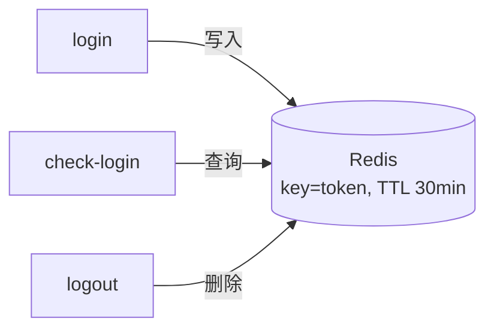

# 登录功能实现指导（v1）

> 本文档是**实现指导**，不是成品代码。每个步骤给出「目标 → 涉及文件 → 关键代码片段 → 要点」，代码片段为骨架级示例，需要你按自己的代码风格补全。
>
> 方案已确认：三种身份识别（用户名/手机号/邮箱）+ BCrypt 校验 + JWT + Redis 30 分钟登录态，三个接口闭环（login / check-login / logout）。登录前置条件是**注册功能已完成**（登录需要真实账号）。

---

## 一、功能目标与前置条件

**目标**：实现三个接口

| 接口 | 方法 | 作用 |
| --- | --- | --- |
| /api/user-service/v1/login | POST | 登录：识别身份 → 校验密码 → 签发 token |
| /api/user-service/check-login | GET | 登录态检查：查 Redis 中的 token |
| /api/user-service/logout | GET | 登出：删除 Redis 中的 token |

**已就绪（本次不动）**：

- `common`：Result / Results / ServiceException / GlobalExceptionHandler（登录错误文案直接抛 ServiceException 即可被兜住）
- `dto.req.UserLoginReqDTO`（usernameOrMailOrPhone + password）、`dto.resp.UserLoginRespDTO`（userId/username/realName/accessToken）
- `service.UserLoginService`（已有 hasUsername / register，本次加三个方法）
- 注册功能已完成（可注册出真实账号用于登录测试）

**本次新增**：Redis 与 jjwt 依赖、Redis 配置、JwtUtil、UserInfoDTO（JWT 载荷）、登录 Service 方法、UserLoginController、集成测试。

**环境前置（重要）**：登录态依赖 Redis，**本机需要先启动 Redis**（当前 6379 端口未运行）。可以：

```bash
# Docker 方式（最省事）
docker run -d --name redis -p 6379:6379 redis
# 或本机安装 Redis 后启动 redis-server
```

---

## 二、功能流程

### 2.1 登录流程

```mermaid
flowchart TD
    A[POST /api/user-service/v1/login<br/>usernameOrMailOrPhone + password] --> B[@Valid 非空校验]
    B -->|失败| B1[返回 400 参数错误]
    B -->|通过| C{输入是否含 @?}
    C -->|是, 视为邮箱| D[查 t_user_mail<br/>where mail=? and del_flag=0]
    D -->|查不到| D1[抛出: 用户名/手机号/邮箱不存在]
    D -->|查到 username| F
    C -->|否| E[查 t_user_phone<br/>where phone=? and del_flag=0]
    E -->|查到 username| F
    E -->|查不到| E1[把输入原值直接当 username]
    E1 --> F[查 t_user<br/>where username=? and del_flag=0]
    F -->|查不到| G[抛出: 账号不存在或密码错误]
    F -->|查到密文| H{BCrypt matches 校验}
    H -->|失败| G
    H -->|通过| I[生成 JWT accessToken<br/>载荷: userId/username/realName]
    I --> J[Redis 缓存 token -> 登录信息<br/>过期 30 分钟]
    J --> K[返回 userId/username/realName/accessToken]
```

**关键点**：

- **映射表里没有密码**：t_user_phone / t_user_mail 只负责"身份 → username"，密码校验统一在主表 t_user 做。
- **手机号查不到要降级为用户名**：输入不是邮箱、又没匹配到已注册手机号时，把输入原值当 username 查主表。
- **查询必须带 del_flag=0**：注销用户 del_flag=1，不带条件的话注销账号仍能登录。
- **两类失败文案**：映射表查不到 → "用户名/手机号/邮箱不存在"；主表账号或密码不对 → "账号不存在或密码错误"（不区分账号与密码，防枚举）。

### 2.2 登录态闭环



- `check-login`：按 accessToken 查 Redis，查到返回登录信息，查不到说明未登录或已过期。
- `logout`：按 accessToken 删 Redis。
- 后续所有需要登录的接口，都通过"请求头带 token → 查 Redis/解析 JWT"判断身份（用户上下文在下一步实现）。

---

## 三、实现步骤

### 第 1 步：补依赖

**涉及文件**：`services/user-services/pom.xml`

```xml
<!-- Redis（Spring Boot 3 使用 spring.data.redis 前缀） -->
<dependency>
    <groupId>org.springframework.boot</groupId>
    <artifactId>spring-boot-starter-data-redis</artifactId>
</dependency>

<!-- JWT（jjwt，与原项目同款） -->
<dependency>
    <groupId>io.jsonwebtoken</groupId>
    <artifactId>jjwt-api</artifactId>
    <version>0.11.5</version>
</dependency>
<dependency>
    <groupId>io.jsonwebtoken</groupId>
    <artifactId>jjwt-impl</artifactId>
    <version>0.11.5</version>
    <scope>runtime</scope>
</dependency>
<dependency>
    <groupId>io.jsonwebtoken</groupId>
    <artifactId>jjwt-jackson</artifactId>
    <version>0.11.5</version>
    <scope>runtime</scope>
</dependency>
```

**要点**：jjwt 的 api/impl/jackson 三者缺一不可（impl 与 jackson 是运行时实现）。

### 第 2 步：Redis 配置

**涉及文件**：`src/main/resources/application.yml`

```yaml
spring:
  data:
    redis:
      host: 127.0.0.1
      port: 6379
      # password: 你的Redis密码（没有密码可省略这行）
```

**要点**：Spring Boot 3 的 Redis 配置前缀是 `spring.data.redis`（不是 2.x 的 `spring.redis`）；Redis 未启动时，登录接口调用会抛连接异常，测试前先确认 `docker ps` 或端口连通。

### 第 3 步：登录 DTO 加校验注解

**涉及文件**：`dto/req/UserLoginReqDTO.java`

```java
@NotBlank(message = "账号不能为空")
private String usernameOrMailOrPhone;

@NotBlank(message = "密码不能为空")
private String password;
```

### 第 4 步：JWT 工具与载荷

**涉及文件**：`common/UserInfoDTO.java`、`common/JwtUtil.java`

```java
// UserInfoDTO —— JWT 载荷，只放非敏感信息
@Data
@Builder
public class UserInfoDTO {
    private String userId;
    private String username;
    private String realName;
}
```

```java
// JwtUtil —— 生成/解析 JWT（骨架）
public final class JwtUtil {
    /** JWT 自身过期时间：24 小时（Redis 缓存是另一层 30 分钟，二者独立） */
    private static final long EXPIRATION = 86400L;
    public static final String TOKEN_PREFIX = "Bearer ";
    private static final String SECRET = "这里放一个足够长的密钥";

    public static String generateAccessToken(UserInfoDTO userInfo) {
        // 1. 把 userId/username/realName 放入 Map，序列化成 subject
        // 2. Jwts.builder() 设置签发时间/签发者/过期时间，HS512 签名
        // 3. 返回 TOKEN_PREFIX + token
    }

    public static UserInfoDTO parseJwtToken(String token) {
        // 1. 去掉 "Bearer " 前缀
        // 2. Jwts.parser() 解析并校验过期时间
        // 3. 解析失败或过期返回 null
    }
}
```

**要点**：

- 密钥生产环境应放配置中心/环境变量，不要硬编码。
- JWT 过期时间（24h）与 Redis 缓存 TTL（30min）是**两层独立机制**：Redis 先失效，JWT 后失效；v1 以 Redis 为准做登录态判断。

### 第 5 步：业务层

**涉及文件**：`service/UserLoginService.java`（加方法）、`service/impl/UserLoginServiceImpl.java`

```java
// UserLoginService 新增
UserLoginRespDTO login(UserLoginReqDTO requestParam);
UserLoginRespDTO checkLogin(String accessToken);
void logout(String accessToken);
```

```java
@Service
@RequiredArgsConstructor
public class UserLoginServiceImpl extends ServiceImpl<UserMapper, UserDO> implements UserLoginService {
    private final UserPhoneMapper userPhoneMapper;
    private final UserMailMapper userMailMapper;
    private final BCryptPasswordEncoder passwordEncoder;
    private final StringRedisTemplate stringRedisTemplate;

    @Override
    public UserLoginRespDTO login(UserLoginReqDTO requestParam) {
        // 1. 识别类型：遍历字符，含 @ 视为邮箱（约定用户名不允许含 @）
        // 2. 邮箱 → 查 t_user_mail(mail, del_flag=0) 拿 username；查不到 → 抛"用户名/手机号/邮箱不存在"
        // 3. 非邮箱 → 查 t_user_phone(phone, del_flag=0) 拿 username；查不到 → 输入原值当 username
        // 4. 查 t_user(username, del_flag=0) 拿密码密文；查不到 → 抛"账号不存在或密码错误"
        // 5. passwordEncoder.matches(明文, 密文) 失败 → 抛"账号不存在或密码错误"
        // 6. 组装 UserInfoDTO → JwtUtil.generateAccessToken
        // 7. Redis 缓存：key=accessToken, value=登录信息JSON, TTL 30 分钟
        // 8. 返回 UserLoginRespDTO
    }

    @Override
    public UserLoginRespDTO checkLogin(String accessToken) {
        // stringRedisTemplate.opsForValue().get(accessToken) → JSON 反序列化为 UserLoginRespDTO
    }

    @Override
    public void logout(String accessToken) {
        // stringRedisTemplate.delete(accessToken)
    }
}
```

**要点**：

- Redis 读写用 `StringRedisTemplate`（key/value 都是字符串），value 存登录响应 JSON。
- `matches(明文, 密文)` 是 BCrypt 校验的正确姿势，不能直接 equals。
- 密码校验失败与账号不存在**返回同一文案**，防止账号枚举。

### 第 6 步：Controller

**涉及文件**：`controller/UserLoginController.java`（新文件，原项目登录三接口独立成控制器）

```java
@RestController
@RequiredArgsConstructor
public class UserLoginController {
    private final UserLoginService userLoginService;

    @PostMapping("/api/user-service/v1/login")
    public Result<UserLoginRespDTO> login(@RequestBody @Valid UserLoginReqDTO requestParam) {
        return Results.success(userLoginService.login(requestParam));
    }

    @GetMapping("/api/user-service/check-login")
    public Result<UserLoginRespDTO> checkLogin(@RequestParam("accessToken") String accessToken) {
        return Results.success(userLoginService.checkLogin(accessToken));
    }

    @GetMapping("/api/user-service/logout")
    public Result<Void> logout(@RequestParam("accessToken") String accessToken) {
        userLoginService.logout(accessToken);
        return Results.success();
    }
}
```

**要点**：`Results` 目前只有 `success(T data)`，如果 `success()` 无参版本缺失，补一个重载即可。

### 第 7 步：集成测试

**涉及文件**：`src/test/java/.../UserLoginTest.java`（@SpringBootTest + @AutoConfigureMockMvc，同注册测试）

| 用例 | 操作 | 期望 |
| --- | --- | --- |
| 登录成功 | 先注册再登录 | code=0，返回 accessToken；Redis 中能查到该 token |
| 密码错误 | 注册后错密码登录 | "账号不存在或密码错误" |
| 账号不存在 | 未注册用户名登录 | "账号不存在或密码错误" |
| 邮箱不存在 | 未注册邮箱登录 | "用户名/手机号/邮箱不存在" |
| 注销用户不可登录 | 注册后手动置 del_flag=1 再登录 | "账号不存在或密码错误" |
| check-login | 登录后查登录态 | 返回登录信息 |
| logout | 登录后登出再 check-login | 查不到，data 为 null |

**测试数据清理**：@AfterEach 删除测试用户（逻辑删除）+ 删除测试产生的 Redis key。

---

## 四、测试与验证

### 4.1 自动验证（当前环境）

```bash
mvn -pl services/user-services test
```

前置：本地 Redis 已启动、MySQL 12306_user 库可用。当前沙箱 Tomcat 无法启动，测试走 MockMvc 模拟环境即可覆盖接口层。

### 4.2 手动验证（本机）

```bash
# 先注册一个账号
curl -X POST http://localhost:9001/api/user-service/register \
  -H "Content-Type: application/json" \
  -d '{"username":"test001","password":"123456","realName":"张三","idType":1,"idCard":"110101199001011234","phone":"13800138000","mail":"test001@example.com"}'

# 登录（用户名方式）
curl -X POST http://localhost:9001/api/user-service/v1/login \
  -H "Content-Type: application/json" \
  -d '{"usernameOrMailOrPhone":"test001","password":"123456"}'

# 手机号方式 / 邮箱方式：把 usernameOrMailOrPhone 换成 13800138000 或 test001@example.com
# 用返回的 accessToken 检查登录态
curl "http://localhost:9001/api/user-service/check-login?accessToken=<上一步返回的token>"
```

---

## 五、验收标准与常见坑

### 验收清单

- [ ] 三种身份（用户名/手机号/邮箱）都能登录，返回 userId/username/realName/accessToken。
- [ ] 密码错误、账号不存在返回统一文案"账号不存在或密码错误"。
- [ ] 注销用户（del_flag=1）无法登录。
- [ ] 登录后 Redis 中存在该 token（TTL 30 分钟），check-login 能查到。
- [ ] logout 后 token 从 Redis 删除，check-login 返回 null。
- [ ] 返回数据不含密码、证件号等敏感信息。

### 常见坑

1. **映射表没有密码**：username 只能从映射表拿，密码必须在主表校验，别在映射表上查密码。
2. **手机号查不到要降级为用户名**：漏掉这个分支，"用户名登录"会 404。
3. **查询必须带 del_flag=0**：不带的话注销账号仍可登录（逻辑删除查询默认会带，手写 LambdaQueryWrapper 时容易漏）。
4. **BCrypt 用 matches 不用 equals**：密文每次不同，equals 永远失败。
5. **Redis 前缀**：Spring Boot 3 是 `spring.data.redis`；Redis 未启动时接口直接连接异常。
6. **Token 有两层过期**：Redis 30 分钟负责登录态，JWT 24 小时负责签名有效性，别混为一谈。
7. **@ 即邮箱的约定**：意味着用户名不允许含 @，注册时也要校验（v1 注册目前没限制，后续补）。
8. **check-login/logout 依赖 Redis**：这两个接口"看起来简单"，但没有 Redis 就完全没有行为。

---

## 附：参考来源

- 原项目对照：`datasource/originalProject/12306/services/user-service`（UserLoginController、UserLoginServiceImpl.login）
- 原项目 JWT 工具：`datasource/originalProject/12306/frameworks/bizs/user/.../toolkit/JWTUtil.java`（jjwt + HS512 + Bearer 前缀）
- 相关设计文档：`docs/登录注册功能设计与用户表设计.md`、`docs/注册功能实现指导.md`
