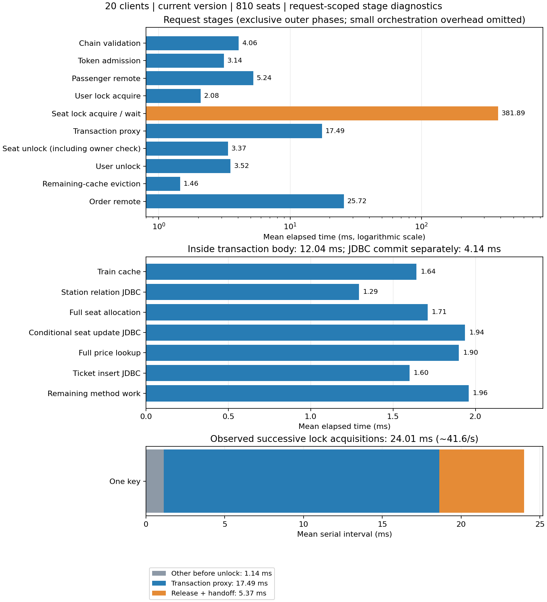

# 20并发购票阶段诊断报告

业务版本：22b0405，未编辑业务源码或重建业务JAR。单Ticket实例，同一批车次1/席别2/北京南→宁波810张原始座位，每轮开始全部可售。

## 测试方法

- 使用本地Byte Buddy 1.14.19的premain探针，按购票请求记录方法调用和单调时钟边界。仅捕获当前请求线程中的关键方法，异步消息任务不在该链路内。诊断数据由独立线程批量写文件，队列非阻塞；每个开启诊断的正式轮次完整trace数量与HTTP成功数一致。
- 直接测量MySQL JDBC Connection.commit、PreparedStatement.execute等调用，区分JDBC往返与数据库performance_schema执行耗时；JDBC commit含驱动提交逻辑，不等于只有服务器COMMIT语句。
- 小堆配置与上一轮一致，关闭历史孤儿扫描和订单兜底扫表，保留延迟关单。最大堆Ticket/User/Nacos/JMeter256MB、Order192MB、Gateway160MB；记录Windows资源与GC。
- 初始序列明显受冷态影响，数据全部保留，单独说明；再完成4轮诊断预热后，采用三组顺序轮换：关闭/共享/逐线程 → 共享/逐线程/关闭 → 逐线程/关闭/共享，各组3轮、每轮8秒。全部为当前版本，不测旧版A。
- 诊断关闭仍加载agent并保留轻量入口检查，因此不等价于完全无agent；关闭/开启用于估计收集阶段数据的额外影响。共享与逐线程客户端使用相同计时、屏障、用户、库存、指标采样及请求保护。
- QPS窗口为首个HTTP发送至最后完成，包含排空；P99来自JTL。各阶段统计为该设置三轮全部请求的合并分布，阶段均值不是轮次中位数。父/子阶段有嵌套，不能把表中所有行相加。

## 平衡顺序的正式结果

|设置|3轮成功QPS|QPS中位数|持锁均值中位数 ms|HTTP P99中位数 ms|成功请求合计|
|---|---|---:|---:|---:|---:|
|shared/False|27.28 / 49.82 / 35.05|35.05|19.11|1289|895|
|shared/True|38.01 / 37.80 / 39.44|38.01|18.17|1366|905|
|per-thread/True|30.47 / 46.91 / 42.48|42.48|15.93|1245|937|

## 共享客户端下的阶段分布

|阶段|平均 ms|P50 ms|P95 ms|P99 ms|说明|
|---|---:|---:|---:|---:|---|
|购票服务方法总耗时|449.298|410.819|905.961|1297.527|不含进入服务方法前的Gateway/认证/排队|
|责任链校验|4.060|3.221|8.495|14.467|包含购票前车站列表查询|
|令牌准入|3.139|2.397|7.960|13.045|包括Redis访问与Lua|
|乘车人远程查询|5.242|4.442|10.730|22.657|含结果校验/组装|
|用户锁获取|2.084|1.648|5.115|10.156|包含Redis往返，不全是争用等待|
|席别锁获取/等待|381.894|349.815|824.771|1219.657|包含争用、网络及调度|
|取得锁到进入事务代理|1.115|1.045|1.756|2.757|包含现有INFO日志和Timer等|
|事务代理完整调用|17.490|15.539|29.091|40.404|包含事务开始、方法体、提交和清理|
|事务进入|0.686|0.644|1.150|1.694|嵌套于事务代理|
|事务方法体|12.043|10.655|19.115|28.305|嵌套于事务代理|
|车次缓存读取/反序列化|1.643|1.411|3.296|5.851|嵌套于方法体|
|站点关系JDBC执行|1.293|1.165|2.057|3.118|不含完整ORM结果映射|
|完整选座分配|1.711|1.525|2.806|3.352|含JDBC查询与结果读取/映射|
|选座JDBC执行|1.375|1.224|2.304|2.671|嵌套于选座分配|
|条件占座JDBC执行|1.938|1.673|2.908|3.362|不含全部ORM处理|
|完整票价查询|1.900|1.759|2.969|3.463|含JDBC及结果映射|
|车票插入JDBC执行|1.600|1.535|2.580|3.094|不含全部ORM处理|
|方法体其余成本|1.960|1.666|2.805|3.819|包含未单独测量的映射/框架/DTO组装等|
|方法返回到事务代理返回|4.761|4.155|9.192|17.781|包含提交、连接重置与清理|
|JDBC提交调用|4.139|3.523|8.278|16.627|嵌套于事务结束，包含驱动逻辑|
|席别锁安全释放|3.372|3.006|6.099|8.764|包含归属检查与解锁|
|席别锁归属检查|1.507|1.326|2.894|4.500|嵌套于安全释放，涉及Redis|
|席别锁unlock调用|1.792|1.586|3.371|4.934|嵌套于安全释放|
|用户锁安全释放|3.521|3.059|6.994|10.361|用户锁独立，不作为席别临界区|
|余票缓存失效|1.459|1.265|2.866|4.207|席别锁外|
|远程建单|25.720|24.713|38.274|48.526|席别锁外|

## 锁交接与串行服务周期

HTTP平均耗时505.048ms，购票服务方法平均耗时449.298ms；两者均值差55.749ms。差值包括客户端/网络、Gateway、进入业务方法前后的过滤器/调度等，未进一步拆开，不冒称全部网关耗时。

同一轮按席别锁获取时刻排序，相邻获取间隔均值 **24.011ms**。取得锁至开始unlockSafely均值 **18.627ms**；从本次unlockSafely开始至下一请求取得锁均值 **5.368ms**。

后者包含归属检查、解锁、下一请求获锁与调度，不能全部叫Redis网络时间。使用解锁开始而非完成作为边界，因为下一线程可能在上一线程收到解锁回复前取得锁。上述时序只用于本轮单key单席别场景；不是所有锁粒度的一般模型。

原持锁Timer从事务代理调用前开始，至返回后结束，未覆盖上述完整交接成本。因此 **1000 / hold 不是接口上限**；实测相邻获锁间隔的倒数约 **41.65/s**，也不能等同于长时间稳定HTTP容量。

## SQL与资源证据

|设置|SQL|平均执行 ms|检查行数/次|
|---|---|---:|---:|
|('shared', False)|COMMIT|4.608|0.0|
|('shared', False)|LIMIT选座|0.952|1.0|

|设置|SQL|平均执行 ms|检查行数/次|
|---|---|---:|---:|
|('shared', True)|COMMIT|3.867|0.0|
|('shared', True)|LIMIT选座|0.974|1.0|

|设置|SQL|平均执行 ms|检查行数/次|
|---|---|---:|---:|
|('per-thread', True)|COMMIT|3.872|0.0|
|('per-thread', True)|LIMIT选座|1.005|1.0|

## 原因分析与优化顺序

**主要请求延迟来自席别锁争用。** 在主要诊断组，获锁等待均值381.89ms，占业务方法总耗时约85.0%。这定位了请求在哪里等待，但决定等待增长速度的是串行服务周期，不能只把等待时间缩短作为解决方案。

**单条选座查询不是当前主要成本。** 完整分配均值1.71ms，数据库执行约1ms/次且检查1行。事务方法体仍有车次缓存、站点关系、票价、条件占座、插票等工作，合计均值12.04ms；JDBC提交均值4.14ms，需另外算事务进入、清理。

**原hold漏掉了真实锁服务周期的一部分。** 事务代理均值17.49ms之外，取得锁到进入事务代理约1.12ms；释放/交接约5.37ms。这解释了为什么按1000/hold计算约57/s，HTTP却只约38/s：单key相邻获锁约24ms，还有HTTP有限窗口的起跑/排空等影响。

**当前代码可出现接近历史50QPS的轮次，但未证明稳定50QPS。** 诊断关闭三轮27.28/49.82/35.05，持锁24.82/13.40/19.11ms；同代码和同810库存下也有明显变化。初始诊断序列从持锁60ms以上逐步降到20ms附近，表明冷态/运行状态影响很大；这不是排除一切代码成本的证据，也不能把唯一最快轮次当作容量。

**没有证据把共享客户端定为主要原因。** 共享开启诊断中位38.01QPS，逐线程42.48QPS，但逐线程三轮30.47/46.91/42.48波动较大，且对应事务耗时也变化。两种客户端业务方法外的HTTP均值差都约56～58ms，不能说共享客户端独有这段损耗。诊断开启没有稳定比关闭更慢，但关闭组波动明显，无法精确估计探针开销百分比；关闭也未卸载agent。

建议优先验证：①把车次、站点关系、票价等相对稳定的只读数据准备/缓存移出占座临界区，保留一致性和失效规则；本轮三个读取阶段合计约4.8ms，这是可调查空间，不是已测提升。②已记录实际取得锁的前提下，评估减少释放前isHeldByCurrentThread的独立Redis往返；Redisson3.31.0的unlock Lua本身校验owner，仍需保留租约失效/异常处理并验证多实例安全，不能直接删检查后宣称正确。③进一步测量MySQL提交/fsync与I/O，保留当前持久性；④拆分锁后事务前约1.1ms中的INFO日志/计时/框架成本，再决定日志移位或采样。

本次没有实施上述业务优化，不降低数据库持久性，不改变锁粒度或选座算法。没有旧版同环境阶段数据，历史50到本轮35的差值仍不能唯一归因；本次给出的是当前成本分布、时序和运行状态证据。

## 资源与收尾

|正式轮次|成功QPS|CPU中位数 %|最低可用内存 GB|page reads/s采样峰值|Windows采样数|
|---|---:|---:|---:|---:|---:|
|stage-confirm-0-shared-0|27.28|36.5|2.237|0|2|
|stage-confirm-0-shared-1|38.01|33.0|2.209|0|2|
|stage-confirm-0-per-thread-1|30.47|34.5|2.208|7|2|
|stage-confirm-1-shared-1|37.80|36.0|2.295|0|1|
|stage-confirm-1-per-thread-1|46.91|22.0|2.388|7|2|
|stage-confirm-1-shared-0|49.82|25.0|2.485|3|1|
|stage-confirm-2-per-thread-1|42.48|34.0|2.447|0|2|
|stage-confirm-2-shared-0|35.05|40.5|2.534|0|2|
|stage-confirm-2-shared-1|39.44|34.5|2.457|7|2|

主要正式窗口最低可用内存2.208GB，分页采样峰值不高，但每轮只有1～2个Windows点，不足以排除瞬时干扰。较快轮次CPU采样较低，不能据少量点认定CPU就是唯一原因。不能将本轮全部差异归因于内存不足。

初始正式9轮加平衡正式9轮，共18轮、4,890次成功；正式令牌拒绝/降级0、无保护上限触发。每轮成功数与订单/明细/车票/座位减少数一致。结束810可售、0占座；现存令牌field须为810，最终检查值为None（None表示已按TTL过期，将由应用重新装载）。本轮新增订单/明细/车票残留0，JAR哈希与先前HEAD构建一致。

停止本次5个服务与监控，端口无监听，可用内存5.007GB；移除6,289条属于本轮已删除订单的延迟任务，不清空其他缓存或用户。

|服务|正式窗口暂停数|Full GC数|最长暂停 ms|累计暂停 ms|
|---|---:|---:|---:|---:|
|nacos|4|0|85.966|125.200|
|user|10|0|81.435|211.700|
|order|53|0|66.259|442.399|
|ticket|127|0|71.495|1127.039|
|gateway|25|0|47.619|236.892|

服务未见OOM、正式窗口无Full GC；累计暂停是该服务的日志事件统计，边界按实际JVM起始时刻对齐，不能把不同服务暂停时长直接相加。JMeter启动的System.gc()另计。探针首次中文目录参数编码异常已在正式测量前通过Base64参数修复并重启Ticket，初始化证据保留。

业务源码保持不变。本次新增诊断agent、运行/分析/核验工具及报告，启动/停止/资源脚本新增独立输出目录参数；没有提交、合并或推送。

## 解释边界

本报告不把不同会话的历史50QPS与本轮比值当成代码回归比例。旧报告20并发实际起点668/717/673张，本轮全部810张；运行资源、探针及客户端配置也有差异。没有旧版同环境对照，无法唯一归因历史差值。
初始序列、冷启动、全部正式JTL与trace都保留在results/stages。平衡顺序数据用于主要分析；初始序列不伪装成稳态，也不删除慢轮次。库存、令牌、订单与车票逐轮对账/释放，资源与最终收尾另附。
