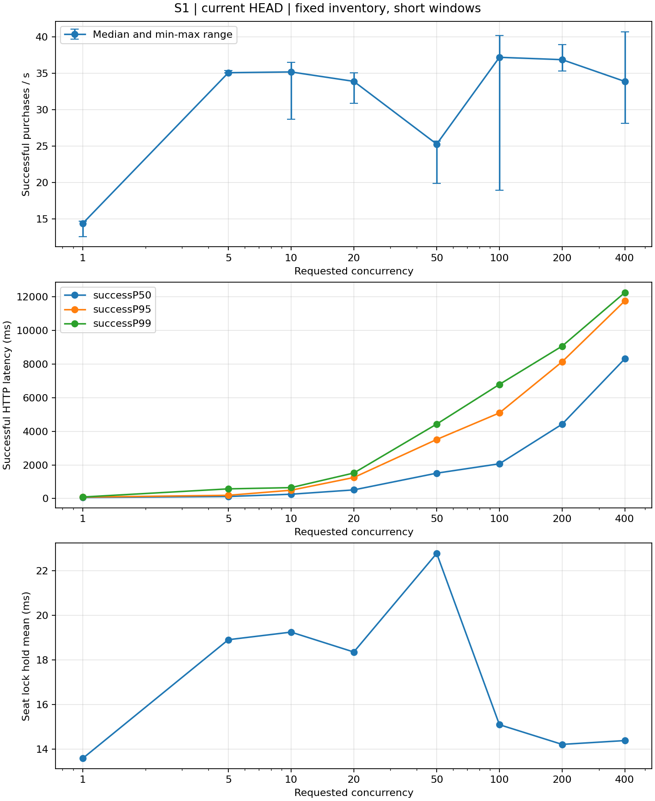
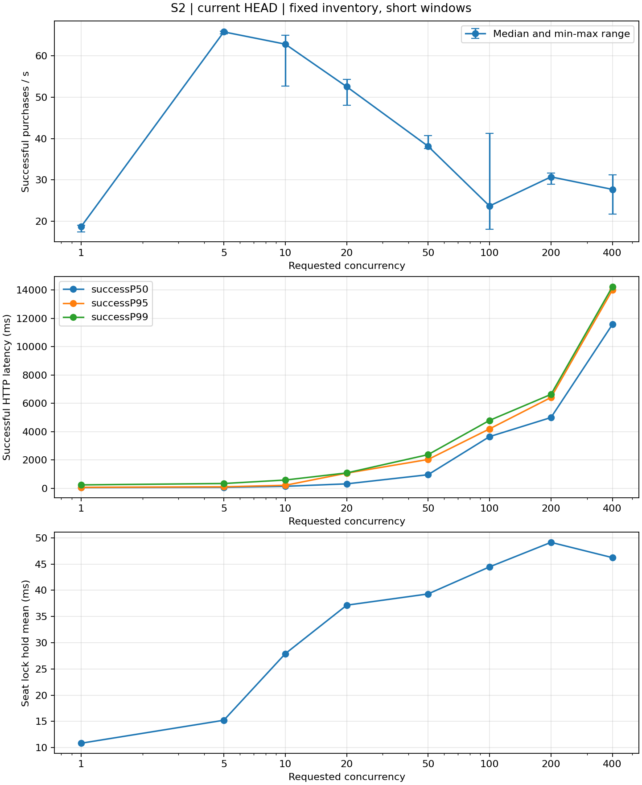

# 当前版本并发性能测试报告

测试日期：2026-10-08。测试提交：`22b0405c2f5b508dc052c0df54ecae52e4318435`，单 Ticket 实例。仅测当前实现，没有旧版本A组，不计算接口提升百分比。

## 环境与统计口径

- 20逻辑CPU、15.73GB内存，同机运行MySQL、Nacos、四个业务服务和JMeter；Redis为远端192.168.204.128。启动前空闲约2.2GB。
- MySQL8.0.44、Redis INFO版本8.8.0、Nacos2.4.3、Java21.0.10、JMeter5.6.3。
- 最大堆：Nacos/User/Ticket/JMeter各256MB，Order192MB，Gateway160MB；最小堆64MB、栈512KB。GC及Windows分页记录保留。
- 单实例调用链为Gateway→Ticket→User/Order，Feign模式，不启动支付和MQ。测试配置关闭历史孤儿扫描、订单定时扫表，延迟关单主通道保留。
- SeatAllocator为三列投影、LIMIT N和idx_seat_allocate；责任链库存COUNT已移除。重复购票处理器仍是占位，本轮不验证乘车人重复购买业务规则。
- 每档至少3轮；三轮成功QPS最大/最小超过1.5时检查资源并追加2轮，保留全部有效轮次。表中为轮次中位数，QPS列最小～最大。成功按业务code=0判断；P分位来自JTL nearest-rank。
- QPS分母为首个HTTP请求开始至最后请求完成，包含排空；起跑屏障、客户端初始化与数据准备在HTTP计时之外。
- S1每轮开始810张可售。730请求保护只用于防止耗尽；达到保护上限的轮次及低于3次购票/客户端的档位不证明长期稳态。
- hold均值为Timer TOTAL_TIME差值/COUNT差值；不报告未埋点的锁等待分位数。Hikari采样和Windows资源有采样盲区，短窗口无法证明全程未出现瞬时峰值。

## S1 正式矩阵

|并发|轮数|成功QPS（范围）|成功P50/P95/P99 ms|持锁均值 ms|成功数中位数|观测窗口中位数 s|保护触发轮数|最少购票/客户端|
|---:|---:|---:|---:|---:|---:|---:|---:|---:|
|1|3|14.38（12.57～14.68）|62/85/91|13.58|111|7.72|0|97.00|
|5|3|35.09（35.04～35.36）|123/193/576|18.90|271|7.73|0|53.80|
|10|3|35.19（28.68～36.48）|257/495/650|19.24|274|7.54|0|21.60|
|20|3|33.90（30.89～35.06）|515/1252/1519|18.35|263|7.87|0|12.15|
|50|3|25.28（19.89～25.67）|1510/3515/4431|22.77|197|8.05|0|3.20|
|100|5|37.20（18.96～40.20）|2069/5095/6792|15.09|307|8.23|0|1.56|
|200|3|36.88（35.33～38.95）|4425/8138/9069|14.21|339|9.37|0|1.67|
|400|3|33.88（28.16～40.72）|8320/11763/12258|14.38|443|13.07|0|1.00|

|并发|乘车人远程均值 ms|建单远程均值 ms|Hikari pending采样峰值|Ticket Windows核数|Ticket JVM CPU %|整机CPU中位数 %|空闲内存最小 GB|page reads/s中位数（峰值）|行锁等待增量|Windows/JVM采样数|
|---:|---:|---:|---:|---:|---:|---:|---:|---:|---:|---:|
|1|3.94|19.06|0|0.36|1.63|17.00|1.600|0.00（7.00）|0|9/19|
|5|5.04|23.26|0|1.12|5.48|31.50|1.573|1.50（7.00）|0|6/18|
|10|5.28|24.75|0|0.96|5.01|37.00|1.227|0.00（39.00）|0|6/17|
|20|5.15|23.97|0|0.99|4.85|42.00|1.452|0.00（3.00）|0|7/18|
|50|10.39|30.11|0|0.93|4.17|41.50|1.389|1.50（1326.00）|0|6/15|
|100|20.92|21.32|0|1.00|4.50|29.50|1.423|0.00（309.00）|0|12/34|
|200|32.78|20.21|0|0.95|4.24|25.50|1.447|0.00（95.00）|0|8/22|
|400|35.92|20.74|0|0.89|1.98|31.00|1.713|0.00（229.00）|0|11/20|

资源指标只选HTTP正式窗口内的采样点。Windows核数需要同轮至少两个点，以进程CPU秒差/墙钟差计算；点数不足标为缺失。JVM CPU为process.cpu.usage采样中位数×100，采用其近期统计口径，不能当作逐请求CPU时间。

OD池数：1；实际trainId+seatType锁key：1。

|并发|正式轮次各trainId/seatType成功扣减合计|
|---:|---|
|1|{'1/2': 323}|
|5|{'1/2': 815}|
|10|{'1/2': 765}|
|20|{'1/2': 785}|
|50|{'1/2': 565}|
|100|{'1/2': 1411}|
|200|{'1/2': 1037}|
|400|{'1/2': 1333}|

各key成功扣减由正式窗口令牌field前后差值汇总，合计与HTTP成功数一致；不代表锁等待分位或每个key独立稳态容量。

|并发|正式起始可售|最少剩余可售|活动锁key数|Hikari active采样峰值|起始idle最小|JVM线程采样峰值|Tomcat busy采样峰值|1000/hold 单key理论服务率|成功QPS/理论服务率|
|---:|---:|---:|---:|---:|---:|---:|---:|---:|---:|
|1|[810]|695|[1]|1|10|107|缺失|73.62|0.195|
|5|[810]|535|[1]|1|10|110|缺失|52.90|0.663|
|10|[810]|535|[1]|1|10|109|缺失|51.97|0.677|
|20|[810]|531|[1]|2|10|120|缺失|54.49|0.622|
|50|[810]|602|[1]|1|10|148|缺失|43.92|0.576|
|100|[810]|484|[1]|1|10|200|缺失|66.25|0.561|
|200|[810]|445|[1]|1|10|299|缺失|70.37|0.524|
|400|[810]|320|[1]|1|10|299|缺失|69.53|0.487|

1000/hold仅为单把锁临界区的理想串行服务率，不是接口QPS；S2多锁均值的倒数也不是系统上限。活动key数表示本轮请求配置涉及的不同key，不代表每个瞬间均有并行事务。Tomcat指标若未暴露则标为不可用。

|并发|选座SQL均值 ms|每次选座检查行数|COMMIT均值 ms|连接获取均值 ms|连接超时增量|EVAL/EVALSHA调用数/成功单|Redis脚本服务器均值 μs|
|---:|---:|---:|---:|---:|---:|---:|---:|
|1|0.648|1.0|3.165|0.030|0.0|6.45|85.74|
|5|0.989|1.0|3.992|0.009|0.0|7.94|96.25|
|10|1.011|1.0|4.240|0.014|0.0|8.20|96.05|
|20|0.936|1.0|3.899|0.030|0.0|8.15|89.72|
|50|1.154|1.0|5.659|0.149|0.0|8.71|114.46|
|100|0.949|1.0|3.763|0.029|0.0|7.93|86.91|
|200|0.860|1.0|3.311|0.032|0.0|8.36|88.81|
|400|0.752|1.0|3.211|0.028|0.0|8.59|80.06|

SQL数据来自performance_schema摘要前后差值，表中为各轮单语句均值的中位数。COMMIT计时是数据库执行阶段，不等于全部事务耗时；Redis命令统计为服务器全局值，包含其他客户端，不能当作纯业务调用链追踪。

正式有效轮次全部成功；令牌拒绝、降级为0。每轮订单、明细、车票、不同座位数及库存减少数与HTTP成功数一致；服务端order.success差值一致。

## S2 正式矩阵

|并发|轮数|成功QPS（范围）|成功P50/P95/P99 ms|持锁均值 ms|成功数中位数|观测窗口中位数 s|保护触发轮数|最少购票/客户端|
|---:|---:|---:|---:|---:|---:|---:|---:|---:|
|1|3|18.71（17.45～19.03）|50/66/239|10.84|90|4.83|0|85.00|
|5|3|65.76（65.26～65.97）|67/103/337|15.23|313|4.78|0|62.40|
|10|3|62.80（52.64～64.97）|139/210/582|27.91|292|4.71|0|24.80|
|20|3|52.51（48.00～54.29）|313/1070/1085|37.16|244|4.67|0|11.20|
|50|3|38.15（37.55～40.71）|957/2033/2374|39.30|189|4.95|0|3.40|
|100|5|23.71（18.04～41.29）|3647/4194/4794|44.45|100|5.13|0|1.00|
|200|3|30.74（28.96～31.65）|4996/6412/6630|49.13|200|6.89|0|1.00|
|400|3|27.71（21.74～31.18）|11576/14011/14237|46.21|400|14.43|0|1.00|

|并发|乘车人远程均值 ms|建单远程均值 ms|Hikari pending采样峰值|Ticket Windows核数|Ticket JVM CPU %|整机CPU中位数 %|空闲内存最小 GB|page reads/s中位数（峰值）|行锁等待增量|Windows/JVM采样数|
|---:|---:|---:|---:|---:|---:|---:|---:|---:|---:|---:|
|1|2.39|18.49|0|缺失|1.21|8.00|2.152|0.00（3.00）|0|3/13|
|5|3.42|21.83|0|缺失|5.98|33.00|2.351|0.00（0.00）|0|3/12|
|10|6.99|32.73|0|缺失|9.01|55.00|2.461|0.00（0.00）|0|2/12|
|20|10.86|41.22|0|缺失|9.71|28.00|2.356|0.00（3.00）|0|3/12|
|50|22.59|44.00|0|缺失|6.17|61.50|2.303|0.00（0.00）|0|2/11|
|100|32.09|50.41|0|缺失|5.58|41.00|1.410|0.00（14.00）|0|5/16|
|200|115.84|52.57|0|缺失|7.17|33.00|2.457|0.00（55.00）|0|3/16|
|400|46.00|46.52|0|0.79|0.89|57.50|1.443|7.00（251.00）|0|8/23|

资源指标只选HTTP正式窗口内的采样点。Windows核数需要同轮至少两个点，以进程CPU秒差/墙钟差计算；点数不足标为缺失。JVM CPU为process.cpu.usage采样中位数×100，采用其近期统计口径，不能当作逐请求CPU时间。

OD池数：26；实际trainId+seatType锁key：4。

|并发|正式轮次各trainId/seatType成功扣减合计|
|---:|---|
|1|{'1/1': 267}|
|5|{'1/1': 373, '1/2': 189, '2/1': 189, '2/2': 189}|
|10|{'1/1': 250, '1/2': 248, '2/1': 176, '2/2': 175}|
|20|{'1/1': 179, '1/2': 183, '2/1': 184, '2/2': 179}|
|50|{'1/1': 142, '1/2': 143, '2/1': 140, '2/2': 138}|
|100|{'1/1': 173, '1/2': 173, '2/1': 174, '2/2': 172}|
|200|{'1/1': 156, '1/2': 154, '2/1': 154, '2/2': 154}|
|400|{'1/1': 300, '1/2': 300, '2/1': 300, '2/2': 300}|

各key成功扣减由正式窗口令牌field前后差值汇总，合计与HTTP成功数一致；不代表锁等待分位或每个key独立稳态容量。

|并发|正式起始可售|最少剩余可售|活动锁key数|Hikari active采样峰值|起始idle最小|JVM线程采样峰值|Tomcat busy采样峰值|1000/hold 单key理论服务率|成功QPS/理论服务率|
|---:|---:|---:|---:|---:|---:|---:|---:|---:|---:|
|1|[12350]|12258|[1]|1|10|218|缺失|92.23|0.203|
|5|[12350]|12035|[4]|2|10|219|缺失|65.67|1.001|
|10|[12350]|12041|[4]|4|10|221|缺失|35.83|1.752|
|20|[12350]|12093|[4]|6|10|221|缺失|26.91|1.951|
|50|[12350]|12146|[4]|3|10|219|缺失|25.45|1.499|
|100|[12350]|12138|[4]|4|10|296|缺失|22.50|1.054|
|200|[12350]|12132|[4]|4|10|300|缺失|20.35|1.510|
|400|[12350]|11950|[4]|6|10|299|缺失|21.64|1.281|

1000/hold仅为单把锁临界区的理想串行服务率，不是接口QPS；S2多锁均值的倒数也不是系统上限。活动key数表示本轮请求配置涉及的不同key，不代表每个瞬间均有并行事务。Tomcat指标若未暴露则标为不可用。

|并发|选座SQL均值 ms|每次选座检查行数|COMMIT均值 ms|连接获取均值 ms|连接超时增量|EVAL/EVALSHA调用数/成功单|Redis脚本服务器均值 μs|
|---:|---:|---:|---:|---:|---:|---:|---:|
|1|0.540|1.0|2.971|0.057|0.0|6.00|66.67|
|5|0.873|1.0|4.020|0.020|0.0|6.12|81.20|
|10|1.358|1.0|8.363|0.020|0.0|6.66|140.08|
|20|1.754|1.0|10.425|0.027|0.0|7.83|136.29|
|50|1.803|1.0|11.984|0.035|0.0|8.86|162.96|
|100|2.111|1.0|13.134|0.045|0.0|8.86|154.24|
|200|2.321|1.0|15.344|0.045|0.0|8.65|149.02|
|400|2.256|1.0|12.083|0.033|0.0|7.91|182.95|

SQL数据来自performance_schema摘要前后差值，表中为各轮单语句均值的中位数。COMMIT计时是数据库执行阶段，不等于全部事务耗时；Redis命令统计为服务器全局值，包含其他客户端，不能当作纯业务调用链追踪。

正式有效轮次全部成功；令牌拒绝、降级为0。每轮订单、明细、车票、不同座位数及库存减少数与HTTP成功数一致；服务端order.success差值一致。

## 结论与瓶颈分析

**单热点在本环境短窗口内首先在5～20并发附近出现平台。** 1并发成功QPS 14.38，5/10/20并发分别为35.09/35.19/33.90；400并发为33.88，P99达12258ms。更多客户端主要增加排队与尾延迟，未形成持续增长的吞吐曲线。

固定810张库存限制了每轮持续时间，200/400并发每客户端迭代不足；上述平台是短窗口观察，不能称为已测得长期最大稳定QPS。未测旧版，因此不能量化本轮选座优化带来的端到端改善率。

**选座全量读取已不是当前主要成本。** S1选座SQL每次检查行数均为1，各档语句均值中位数约0.648～1.154ms；而持锁均值中位数为13.58～22.77ms。SQL摘要中的选座时间不是完整MyBatis分配时间，但已证明限量访问在实际购票中生效。继续削减该条SQL难以单独解决所有接口排队。

当前锁内事务还包括车次缓存读取/反序列化、站点关系查询、条件占座更新、票价查询、车票插入和事务提交。乘车人查询位于加席别锁前，远程建单位于释放锁后；远程调用虽然移出临界区，仍影响HTTP响应和闭环客户端循环速度。

单key串行化与延迟增长一致，席别锁是重要串行化点；但成功QPS与1000/hold仍有明显差距。hold埋点从全部席别锁取得后开始，至事务返回结束，未包含锁获取等待及释放成本。不能把剩余差距直接全归因于Redisson交接：还需测锁等待、加解锁/Redis网络、线程调度及锁外链路。

**S2并不呈现按锁数线性扩展。** 正式场景为26个有价格且可购买的OD池、4个实际trainId+seatType key；1并发只涉及1个key，其余档位涉及4个。最高档位中位数为5并发的65.76成功QPS，400并发为27.71。它与S1的OD、席别和库存规模不同，不能把比值全部归因于锁数量。

S2并行事务下持锁、SQL和COMMIT开销应结合上表比较。当前保持innodb_flush_log_at_trx_commit=1、sync_binlog=1，buffer pool为128MiB；没有通过降低持久性来换吞吐。COMMIT时间上升提示提交路径值得调查，但缺少fsync、磁盘时延及数据库内部等待采样，不能直接断言磁盘是唯一瓶颈。

Hikari获取均值、pending、连接超时和行锁等待为本轮实际指标；采样未观察到排队不等于排除所有瞬时等待。Windows page reads包含文件映射等缺页，不等于全部都是交换。低可用内存、同机负载及JMeter新JVM的启动/编译会影响状态；起跑屏障仅剔除请求计时中的准备成本，并不能证明压测端零干扰。

## 异常轮次、夹具与工具修正

- 初次启动沿用历史数据时，孤儿车票扫描和定时扫表干扰库存；正式环境关闭这两个背景任务并重新核对。延迟关单保留。这是测试配置差异，结果不等价于所有默认背景任务开启时的性能。
- Redis会话TTL为30分钟；首次长矩阵的过期会话轮次不采用。现在每并发档登录刷新，不以JWT有效期代替Redis准入有效期。
- JSR223最早计时包含脚本编译与起跑等待，单线程相邻样本出现时间重叠。修正后按HTTP发送开始设置时间戳和idle时间，JTL标签为POST purchase [HTTP timing v2]；正式矩阵只采用修正标签。p2-throughput.jmx新增8行保护逻辑，仅当当前工具设置current.client时启用。
- 原座位数据枚举得到41个OD/5个key，但车次3为BULLET，不支持legacy席别1，且没有该席别票价。150线程诊断中30个请求失败，29次令牌降级；API复现车票价格数据缺失，数据库占座已回滚。失败补偿可给原先不存在的field增加令牌，留下与数据库不一致的数值。证据见results/s2-fixture-diagnosis.json；不据此断言历史报告每次令牌拒绝原因已完全查清。
- 正式S2筛选席别1/2下支持且有精确OD价格的26个池/4个key，并清除诊断产生的特定无效令牌缓存。未修改业务错误处理，未编造新座位或票价。
- S2在50并发下一轮预检查前，Redis短连接耗尽Windows临时端口，未形成该轮HTTP样本。工具改为每线程复用RESP连接，以resume保留有效轮次继续；连接复用位于测试观测工具，未更改业务服务Redis客户端。

## 后续定位顺序

1. 先补齐席别锁等待、获取/释放耗时及锁内各阶段Timer；按请求关联区分SQL执行、JDBC传输/映射和事务提交，验证1000/hold与成功QPS的差距来源。
2. 采集Redis往返与锁交接、MySQL提交/fsync和I/O等待；为站点关系、票价等读查询核对索引与缓存收益，避免再次只盯选座SQL。
3. 查清无效席别请求与降级补偿的令牌边界，补足按OD价格/车型校验，先修正确性再扩展测试池。
4. 若串行临界区确为主要瓶颈，再设计更细锁粒度或不同占座方案。需重新验证相邻区间同物理座位冲突、多人同车厢和失败补偿，不能仅将key加OD便宣称安全。
5. 持续容量验证需单独设计不被810张库存消耗截断的长期工作负载，同时保证回收与新购互不污染；本轮不额外改造库存或降低数据库持久性。

## 原始证据与解释边界

本地results下保留每轮JTL、JSON指标差值、GC日志、机器资源JSONL、SQL汇总与矩阵。results被忽略，不提交包含JWT的users.csv。
全部有效轮次按业务成功对账；不同座位按车次、OD、席别、车厢和座位判重。本轮没有验证跨重叠OD的同物理座位冲突，没有进行支付或出票。固定810张库存高并发窗口有限，不能直接外推生产规模或稳定持续吞吐。
应用Timer percentile端点本轮返回非零，不能沿用历史SimpleMeterRegistry分位为零的结论；其滚动统计不作为正式窗口分位，HTTP分位仍来自JTL。Tomcat线程端点未暴露，以缺失记录，不补填估计值。

## 最终核验与资源回收

正式有效轮次52轮，共12,888次成功购票。S1每档至少3轮，100并发5轮；S2同样100并发5轮，保留所有有效波动轮次。总QPS等于成功QPS，成功率均为100%，落座失败等失败分类为0。

结束后目标池为810张/810可售/0占座；S2为12,350张/12,350可售/0占座。本轮新增订单、订单明细及perf400车票残留均为0，今日目标池车票残留0。保留74条九月遗留、order_sn为空的历史测试记录，不把它们当作本轮交易或清理对象。已加载的令牌field与恢复库存一致，JAR哈希未改变。

关闭业务服务后，按本轮日志的perf400订单号且确认订单已从数据库清理，移除7,681条待执行延迟关单记录；不按Redis key全量删除。清理后本轮待执行记录为0，证据见scheduled-cleanup-verification.json。预热和正式交易均在各轮结束后释放，延迟队列清理在全部测量结束后执行，不改变已测数据。

正式窗口Windows采样的最低可用内存1.227GB；可用内存波动体现本机限制，不能把全程当作恒定2GB资源。停止自有服务和监控后，8848/9848/9000～9003均无监听，可用内存采样为3.705GB；MySQL及远端Redis保留，未关闭用户应用。

|服务|正式窗口GC暂停数|正式Full GC数|正式窗口最长GC暂停 ms|
|---|---:|---:|---:|
|nacos|10|0|35.855|
|user|15|0|79.888|
|gateway|32|0|38.485|
|order|166|0|35.207|
|ticket|227|0|37.040|

GC窗口按保存的实际JVM启动时间加日志uptime对齐，只有暂停完成时刻处于HTTP窗口的事件进入表中，边界有微小误差。服务GC日志及stderr/stdout检查未见OOM，服务正式窗口无Full GC；JMeter各次启动出现System.gc() Full GC，不能宣称所有JVM完全没有Full GC。每轮JMeter为新JVM，客户端连接/JIT未跨轮保留，这是短窗口的额外限制。

业务源文件未修改。工作区新增本目录计划、工具、报告及图，并对旧JMX增加仅供当前工具启用的计时修正；没有自动提交、合并或推送。