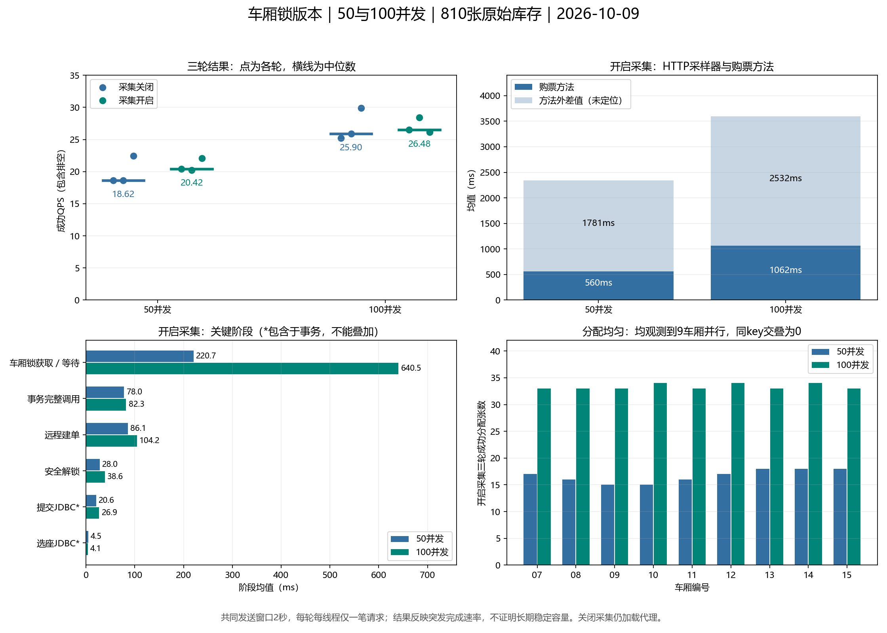

# 车厢锁版本：50与100并发性能报告

测试日期：2026-10-09。仅测试当前车厢锁版本；业务源码、JAR、表结构和连接池配置未修改。上次20并发结果仅作历史参考。

后续诊断已确认每轮新客户端JVM存在显著首批执行开销，响应分类也包含在HTTP采样中。本报告原始数字保留，解释为对应突发请求的完成速率；不得据此认定预热后的持续容量只有20～30QPS。分段证据及未定位边界见[HTTP方法外耗时来源诊断报告](HTTP方法外耗时来源诊断报告.md)。

## 环境和口径

单Ticket实例、Feign；Nacos/User/Ticket/JMeter最大堆256MB，Order192MB、Gateway160MB。每轮车次1、席别2、北京南→宁波从原810张可售票开始，共9个车厢。共享HTTP客户端，QPS从首个HTTP发送至最后响应完成，包含排空。HTTP采样排除初始化、屏障和脚本编译，包含同步发送、响应读取和采样器响应分类；并非仅购票方法计时。
每档3轮独立预热与短时校准，结合较高实测速率的1.5倍及100个在途请求余量选择共同窗口；正式消耗不超过405张，超出时统一缩短并重测。预热交易在正式窗口外清理。每档采集关闭、开启各3轮；关闭仍加载代理，不等于无探针。
正式共同窗口：**2秒**。排除轮次：0，原始数据保留在excluded-rounds.json。短窗口不证明长期稳定容量。

## 正式结果

|并发|采集|三轮成功QPS|中位数|范围|成功P95中位数 ms|成功P99中位数 ms|成功次数|
|---:|---|---|---:|---|---:|---:|---:|
|50|关|18.62 / 18.60 / 22.43|18.62|18.60～22.43|2673|2678|150|
|50|开|20.42 / 20.22 / 22.10|20.42|20.22～22.10|2445|2446|150|
|100|关|25.23 / 25.90 / 29.89|25.90|25.23～29.89|3809|3841|300|
|100|开|26.48 / 28.40 / 26.16|26.48|26.16～28.40|3710|3755|300|

全部有效正式请求成功，成功率100%，总QPS与成功QPS相同；失败分类全部为OK。令牌拒绝、降级和数量保护触发均为0，订单/明细/车票/占座及唯一坐标一致。

**测量限制：50并发每轮仅50次、100并发每轮仅100次，即每个线程一笔购票。各轮HTTP请求尚未完成时2秒发送预算已经结束，没有形成持续循环施压。上述QPS是这一批并发请求的完成速率，不能用来确定饱和点或长期稳定容量。**

本次同条件50→100并发，关闭采集的QPS中位数增长39.1%，开启采集增长29.7%，均未翻倍；两组P99均上升。采集开/关三轮范围部分重叠且存在运行时波动，不能将开组更高的吞吐解释成采集带来性能提升。

## 阶段分析

开启采集的三轮请求合并统计，父子阶段不能重复相加。阶段累计多次尝试时只解释累计耗时；事务首末边界仅使用一次尝试的请求。

|阶段|50并发均值 ms|100并发均值 ms|
|---|---:|---:|
|购票方法|559.801|1062.394|
|责任链|9.501|25.593|
|令牌准入|16.934|38.730|
|乘车人查询|18.419|42.500|
|车厢锁获取/等待|220.715|640.535|
|事务完整调用|77.977|82.259|
|事务业务方法|53.831|51.790|
|完整选座|5.355|4.802|
|选座JDBC|4.530|4.098|
|条件占座JDBC|10.060|8.555|
|车票插入JDBC|7.970|6.146|
|提交JDBC|20.617|26.880|
|安全解锁|27.953|38.643|
|远程建单|86.132|104.235|
|Ticket取连接|0.171|0.195|
|单次事务建立边界|1.540|1.733|
|单次事务退出边界（含提交）|22.606|28.736|

|并发|HTTP均值 ms|购票方法均值 ms|方法外差值 ms|最多并行车厢|候选不足|兜底|DB重试|
|---:|---:|---:|---:|---:|---:|---:|---:|
|50|2340.82|559.80|1781.02|9|0|0|0|
|100|3594.86|1062.39|2532.47|9|0|0|0|

HTTP方法外差值包括客户端及响应处理、网络、网关/鉴权与分发，未单独定位，不能全称网关耗时。同车厢key临界区交叠为0，跨车厢并行来自同一JVM单调时钟证据。

### 主要原因和未定位边界

1. **并行生效，但同车厢排队明显。** 两档均观测到9个车厢临界区同时存在，分配均匀，无同key交叠。开启采集50并发每车厢15～18张，100并发每车厢33～34张；全部走一次候选快路径，无候选不足、跨车厢兜底和DB重试。车厢获取/等待均值220.7→640.5ms，是购票方法内部增加最明显的阶段。该阶段包含Redis锁操作往返和调度，不能全部解释为纯排队时间。
2. **选座查询不是本轮最大阶段，提交仍占据锁内时间。** 选座JDBC约4～5ms，完整事务约78～82ms。提交JDBC20.6→26.9ms，占事务约26%→33%；释放锁前必须完成提交，因而提交延迟会放大后续车厢等待。价格/站点读取等仍在事务内，按计划没有额外优化。
3. **远程建单有所变慢，但连接池证据不足以解释秒级延迟。** 远程建单86.1→104.2ms。Ticket连接获取平均低于0.1ms，Order不高于4.2ms；均无连接超时，Order少数采样pending为2。采样稀疏，不能据此排除短暂争抢，也不支持将全部延迟归因于连接池容量。
4. **方法外耗时尚未定位，不能只归因于车厢锁。** HTTP均值2340.8→3594.9ms，购票方法仅559.8→1062.4ms；方法外差值约1781.0→2532.5ms，是本轮必须进一步拆分的部分。当前没有客户端发送/接收、网关各阶段及Ticket入口队列的独立时间戳，无法区分这些环节。
5. **本轮绝对结果明显低于历史20并发，但无法做严格退化归因。** 历史采集关闭中位数122.15QPS、开启145.12QPS，仅作参考。当前JAR指纹一致，性能差异不能自动证明业务实现退化；并发和运行会话不同，本轮提交、锁等待和方法外延迟均需按现有证据独立解释。CPU采样出现99%，资源竞争或客户端运行时开销是待验证因素；没有证据证明单一原因。

## 连接池、SQL与资源

|并发|采集|服务|获取连接平均 ms|连接超时|正式窗口采样点|最大采样pending|
|---:|---|---|---:|---:|---:|---:|
|50|关|ticket|0.0843|0|5|0.0|
|50|关|order|2.6830|0|5|2.0|
|50|开|ticket|0.0771|0|4|0.0|
|50|开|order|1.8642|0|4|0.0|
|100|关|ticket|0.0845|0|9|0.0|
|100|关|order|0.3095|0|9|0.0|
|100|开|ticket|0.0769|0|9|0.0|
|100|开|order|4.1758|0|9|2.0|

### 服务器语句摘要（开启采集，三轮按执行次数加权）

|指标|50并发|100并发|
|---|---:|---:|
|Ticket提交|19.681ms / 150次|25.550ms / 299次|
|Order提交|22.177ms / 150次|26.523ms / 298次|
|限量选座|3.689ms / 150次|3.140ms / 300次|

语句摘要快照跨多个连接读取，不与请求结束原子同步，因此提交计数可能与成功请求相差1～2；交易正确性以订单/车票/座位对账为准，不使用摘要计数冒充事务数。

正式资源采样7点，最低可用内存1.81GB，最高采样CPU 99%，最高pageReads/sec 11。短窗口采样稀疏，不能排除未捕获尖峰。没有触发低内存终止条件。

Ticket与Order语句摘要差值、检查行数和耗时见larger-summary.json；驱动计时、服务调用及服务器SQL口径不同。服务GC已按进程创建时间对齐至正式窗口，见final-verification.json。

|服务|正式窗口GC暂停次数|Full GC|最长暂停 ms|暂停总和 ms|
|---|---:|---:|---:|---:|
|nacos|0|0|0.000|0.000|
|user|4|0|26.748|45.299|
|order|10|0|86.794|184.945|
|ticket|15|0|56.996|211.387|
|gateway|1|0|33.539|33.539|

JMeter每轮新建JVM，其整个进程（含窗口外初始化）最长GC暂停为55.515ms，Full GC总数12；本次这12次均标记为显式System.gc()，每轮一次，不能据此认定内存耗尽。该口径不与服务端正式窗口暂停总和相加，也不能据此认定客户端运行时没有其他调度或编译开销。

## 正确性、清理与复现

12轮共900次成功购票；核对本轮1501个订单号，订单、明细、车票残留均为0。最终810张全部可售，目标池外未改变，令牌值810（None表示TTL过期）。
清理本轮1501个延迟任务，没有整体删除队列；所有本轮服务停止，停止核验可用内存4.17GB。未提交、合并、推送，也未继续200/400并发。
复现：run-carriage.py preflight --output-dir 新目录；start-current-services.ps1指定该目录与代理；单请求smoke；run-carriage.py larger --output-dir 同目录；停止服务；清理本轮延迟任务；run-carriage.py verify --output-dir 同目录；analyze-carriage-larger.py。启动后保存各服务CreationDate到process-start-times.json。原始JTL、SQL差值、阶段和锁事件均在独立results/carriage-50-100目录，JWT文件被Git忽略。

## 后续建议（本次未执行）

优先补充客户端纯send计时、Gateway入口/鉴权/路由转发、Ticket入口到购票方法开始的时间戳，解释1.8～2.5秒方法外差值；其次在确认CPU与提交耗时稳定后复测，而不是继续增加并发或细化座位锁。若需要评估持续容量，须另外设计不会过快耗尽810张库存的测试，并将吞吐口径与本轮突发请求分开。

